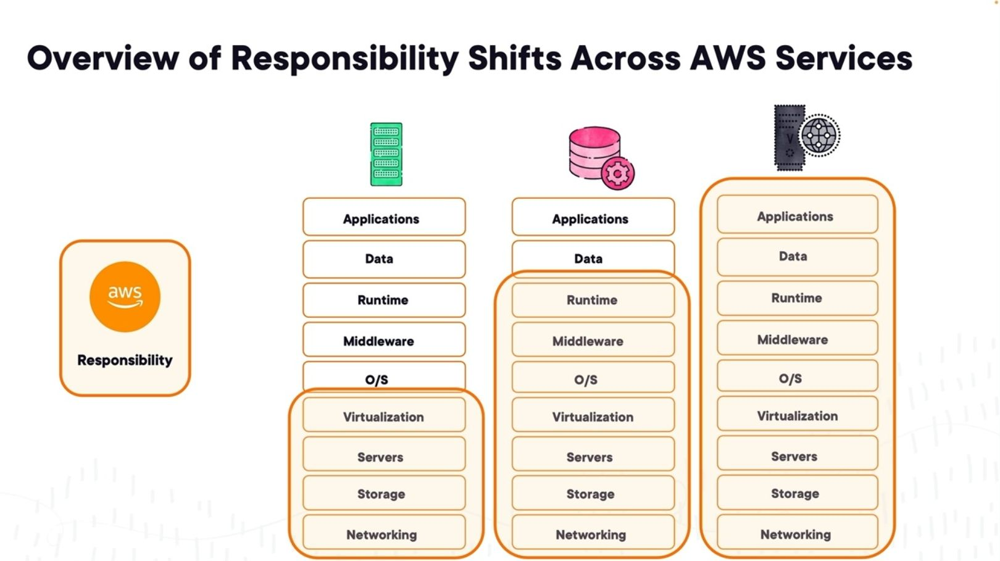

--> [AWS](/00-Intro/AWS.md)
--> [AWS](/00-Intro/AWS.md)  -  [Sicurezza](/09-Sicurezza-Compliance-Governance/Sicurezza-Compliance-Governance.md)
# AWS Shared Responsibility Model

## Cos'è il Modello di Responsabilità Condivisa?

Il modello di responsabilità condivisa di AWS stabilisce la ripartizione delle responsabilità tra **AWS** e il **cliente** per la sicurezza e la conformità nel cloud.
Il **modello di responsabilità condivisa di AWS** definisce chiaramente la suddivisione dei compiti in termini di sicurezza e conformità tra **AWS**, che si occupa della protezione dell'infrastruttura cloud, e il **cliente**, responsabile della sicurezza della configurazione e dei dati all'interno del cloud. Questo modello assicura trasparenza e collaborazione, ponendo le basi per un utilizzo sicuro dei servizi AWS.

Due frasi ricorrenti per spiegare lo Shared Responsibility Model sono:
- Il cliente è responsabile per la sicurezza NEL cloud
- AWS è responsabile per la sicurezza DEL cloud

---

## Responsabilità di AWS (Sicurezza del Cloud)

AWS è responsabile della **sicurezza dell'infrastruttura** che esegue tutti i servizi offerti nel cloud AWS. Questo include:

- Infrastruttura fisica (data center, reti, hardware).
- Software che supporta i servizi cloud (es. hypervisor, storage, database gestiti).
- Sicurezza dell'infrastruttura globale (regioni, zone di disponibilità, edge location).

---

## Responsabilità del Cliente (Sicurezza nel Cloud)

Il cliente è responsabile della **sicurezza e configurazione dei servizi** utilizzati nel cloud, tra cui:

- Configurazione delle istanze EC2 e dei gruppi di sicurezza.
- Gestione degli accessi (IAM).
- Crittografia dei dati (a riposo e in transito).
- Aggiornamento e patch del sistema operativo guest (per i servizi non completamente gestiti).
- Configurazione delle policy e dei firewall applicativi.

Le aree nel modello la cui responsbilità è del cliente sono:
- **Customer Data:** Retention, crittografia, backups, Accesso
- **Platform, Applications, Identity and Access management:** la sicureza delle risorse e delle interconnessioni tra le risorse (anche esterne)
- **Sistemi operativi, Network e configurazione del Firewall:** assicurarsi che i sistemi operativi siano aggiornati, che le connessioni tra servizi siano sicure, che gli utenti abbiano solo i permessi di cui necessitano.
- Crittografia dei dati client-side
- Integrità dei dati
- Autenticazione
- Crittografia dei dati server-side
- Protezione del traffico sulla rete

**NB:** Utilizzare servizi gestiti è un modo per affidare alcune delle responsabilità in materia di sicurezza al cloud AWS.
e.g., Se ho un DB su [EC2](/01-Compute-options/Amazon-EC2.md) sono io responsabile delle patch del sistema operativo, mentre se utilizzo un servzio gestito come [RDS](/04-Database-services/Amazon-RDS.md) allora la responsabilità è di AWS.

---

## Esempio

- **[Amazon S3](/02-Storage-services/Amazon-S3.md)**: AWS protegge l'infrastruttura di S3, ma il cliente è responsabile di impostare correttamente i permessi bucket.
- **[Amazon EC2](/01-Compute-options/Amazon-EC2.md)**: AWS gestisce l'hardware e il hypervisor, ma il cliente gestisce il sistema operativo, i pacchetti, e le configurazioni di rete.

---

## Benefici del Modello

- Chiarezza nei ruoli e responsabilità.
- Maggiore controllo da parte del cliente dove necessario.
- Scalabilità della sicurezza con l'infrastruttura AWS.

---

Il modello di responsabilità condivisa aiuta a definire i confini tra ciò che viene protetto da AWS e ciò che deve essere gestito dal cliente, promuovendo una maggiore consapevolezza e sicurezza complessiva nel cloud.

---

## Modello di Responsabilità per Servizio

AWS offre servizi che vanno da soluzioni completamente gestite a servizi che lasciano al cliente un maggiore controllo. 
Il **livello di responsabilità** varia a seconda del [tipo di servizio cloud](/00-Intro/Tipi-di-servizi-cloud.md) utilizzato: IaaS, PaaS o SaaS.

### IaaS (Infrastructure as a Service)
- **AWS gestisce**: rete, storage, virtualizzazione e server fisici.
- **Cliente gestisce**: sistema operativo, middleware, applicazioni e dati.
- 📌 *Esempio*: se affitti una macchina virtuale, devi installare e mettere in sicurezza il software.

### PaaS (Platform as a Service)
- **AWS gestisce**: sistema operativo, motore del database, aggiornamenti.
- **Cliente gestisce**: dati, sicurezza, configurazioni.
- 📌 *Esempio*: AWS mantiene il database, ma tu imposti gli utenti e la crittografia.

### SaaS (Software as a Service)
- **AWS gestisce**: tutto tranne codice e dati.
- **Cliente gestisce**: codice e configurazioni di sicurezza.
- 📌 *Esempio*: AWS esegue automaticamente il codice, ma tu controlli permessi e sicurezza.

📈 Man mano che si passa da IaaS a SaaS, **la responsabilità di AWS aumenta** e il **carico operativo per il cliente diminuisce**.

## Vantaggi dei Servizi AWS

- ✅ **Riduzione del carico operativo**: aggiornamenti, patch e sicurezza sono gestiti da AWS.
- ✅ **Scalabilità automatica**: le risorse si adattano in base alla domanda (es. aumento di traffico durante il Black Friday).
- ✅ **Affidabilità**: ridondanza e backup nei data center AWS riducono i tempi di inattività.
- ✅ **Integrazione continua**: i servizi AWS lavorano insieme, facilitando la transizione tra server, software e database.
