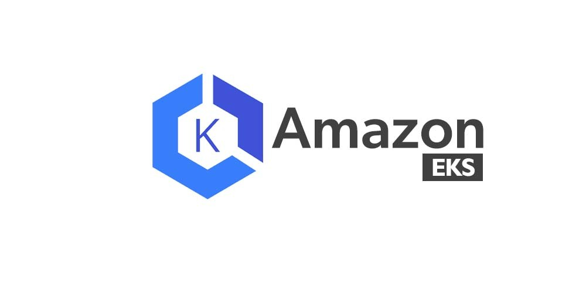

--> [AWS](/00-Intro/AWS.md)  -  [Compute Options](/01-Compute-options/AWS-Compute-Options.md)
# Amazon EKS (Elastic Kubernetes Service)

Amazon EKS è un servizio **gestito** che consente di eseguire facilmente cluster Kubernetes su AWS, senza dover installare, operare o mantenere i nodi di controllo Kubernetes. Grazie alla sua integrazione nativa con l’ecosistema AWS, EKS permette di orchestrare container in modo scalabile, sicuro e conforme agli standard di Kubernetes open-source.

---

## 🔧 Cos'è e come funziona

Amazon EKS fornisce un **control plane Kubernetes altamente disponibile**, distribuito su più zone di disponibilità (AZ) per garantire resilienza e tolleranza ai guasti. Gli utenti possono:

- Creare e gestire cluster Kubernetes in pochi minuti
- Eseguire i nodi worker su istanze EC2 o in modalità serverless con AWS Fargate
- Delegare la gestione delle patch, aggiornamenti e high availability del control plane direttamente ad AWS

Inoltre, EKS supporta strumenti di configurazione e deployment come `kubectl`, Helm e GitOps, permettendo una gestione coerente dei cluster.

---

## ⭐ Caratteristiche principali e vantaggi

- **Gestione automatica del control plane:** AWS si occupa di provisioning, scalabilità e manutenzione del control plane.
- **Compatibilità con Kubernetes open-source:** Nessuna differenza rispetto a Kubernetes standard. Puoi utilizzare gli stessi manifest YAML e strumenti (kubectl, Helm, ecc.).
- **Integrazione nativa con servizi AWS:**
  - [IAM](/09-Sicurezza-Compliance-Governance/Sicurezza/AWS-IAM.md) per l'autenticazione e autorizzazione dei pod e degli utenti
  - [Amazon CloudWatch](/08-Auditing-Monitoring-Logging/Amazon-CloudWatch.md) per log e monitoraggio
  - ELB per bilanciamento del carico (ingress)
  - [EBS](/02-Storage-services/Amazon-EBS.md) ed [EFS](/02-Storage-services/Amazon-EFS.md) per storage persistente
- **Supporto multi-AZ:** Alta disponibilità garantita su più zone di disponibilità
- **Flessibilità di deployment:** 
  - **EC2:** maggiore controllo e possibilità di personalizzazione
  - **Fargate:** ambiente serverless per cluster gestiti completamente da AWS
- **Aggiornamenti semplificati:** AWS offre tool e versioni testate di Kubernetes per minimizzare i rischi

---

## 🚀 Use Cases

- **Esecuzione di applicazioni containerizzate complesse** in produzione con alta disponibilità
- **Migrazione di workload da on-premises** o da altri provider Kubernetes (es. GKE, AKS) a EKS
- **Ambienti DevOps e CI/CD**, sfruttando strumenti come ArgoCD, Flux, Jenkins
- **Architetture a microservizi**, con autoscaling e resilienza integrata
- **Machine learning & batch processing**, grazie all’integrazione con servizi come S3, SageMaker o AWS Batch

---

## 💰 Pricing

Amazon EKS applica un costo **fisso** per il control plane e addebita separatamente le risorse utilizzate (EC2, Fargate, storage, rete):

- **Control Plane:** $0.10/ora per cluster
- **Nodi EC2:** Prezzo in base al tipo e numero di istanze
- **Fargate:** Prezzo basato su CPU e memoria allocata per ogni pod
- **Storage e networking:** secondo i piani standard AWS ([EBS](/02-Storage-services/Amazon-EBS.md), [EFS](/02-Storage-services/Amazon-EFS.md), VPC, ecc.)

---

## 🔐 Sicurezza

- **IAM-based RBAC:** Controlli granulari sugli accessi a livello di cluster, namespace e risorse
- **KMS per cifratura:** I dati sensibili, come i segreti Kubernetes, possono essere criptati con AWS Key Management Service
- **Private endpoint:** Possibilità di isolare completamente l’accesso al cluster in rete privata
- **Policy di sicurezza pod-level:** Supporto per `PodSecurityPolicies`, `OPA Gatekeeper`, `Kyverno`, ecc.
- **Audit Logging:** Log di audit integrati tramite CloudWatch

---

## 🔄 Confronto con servizi simili in AWS

| Servizio         | Tipo               | Quando usarlo                                               |
|------------------|--------------------|-------------------------------------------------------------|
| **EKS**          | Kubernetes gestito | Per app containerizzate con esigenze di orchestrazione avanzata |
| **ECS**          | Proprietario AWS   | Per app containerizzate che non richiedono Kubernetes       |
| **EC2 + Docker** | Manuale            | Per ambienti legacy o sperimentazione senza orchestratore   |
| **Fargate**      | Serverless runtime | Per deploy semplici, con provisioning e scaling automatico  |

➡️ Approfondisci: [EC2vsECSvsEKS](/01-Compute-options/EC2vsECSvsEKS.md)

---

## 📊 Strumenti e integrazioni consigliate

- **Monitoring:** Prometheus + Grafana, CloudWatch Container Insights
- **Logging:** Fluent Bit/Fluentd + CloudWatch Logs/OpenSearch
- **Service Mesh:** AWS App Mesh, Istio
- **CI/CD:** CodePipeline, ArgoCD, GitHub Actions, Jenkins
- **Autoscaling:** Cluster Autoscaler, HPA (Horizontal Pod Autoscaler)

---

## 📌 Best Practices

- Isolare ambienti (dev, test, prod) in cluster diversi o namespaces con policy ben definite
- Utilizzare versioni supportate e aggiornate di Kubernetes
- Abilitare i log di audit e utilizzare IAM Roles for Service Accounts (IRSA)
- Configurare il Cluster Autoscaler o Karpenter per ottimizzare i costi
- Monitorare con strumenti come CloudWatch, Datadog o Prometheus

---

Se vuoi, posso anche generare un **diagramma dell’architettura tipica EKS**, oppure aggiungere esempi YAML o Terraform. Fammi sapere!
