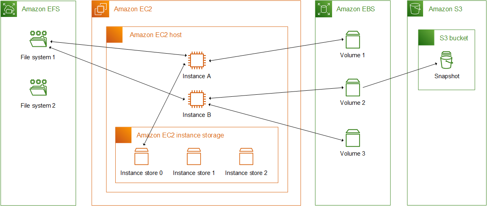

--> [AWS](/00-Intro/AWS.md)
# Panoramica dei Servizi di Storage AWS

AWS offre un ampio portafoglio di servizi di **storage cloud**, progettati per soddisfare esigenze diverse in termini di accesso ai dati, performance, costi e casi d'uso. Lo storage AWS si può classificare in base al tipo di dati e alla modalità di accesso.

Ci sono due macro categorie storage:
- [Storage per EC2](/02-Storage-services/EC2-Storage.md)
- [Amazon-S3](/02-Storage-services/Amazon-S3.md)

## Categorie principali di storage

### 1. **Object Storage**

- Archiviazione scalabile e duratura di oggetti (file, immagini, backup, ecc.).
- Accesso tramite API HTTP/S.
- Servizio principale: [Amazon-S3](/02-Storage-services/Amazon-S3.md)

### 2. **Block Storage**

- Archiviazione a blocchi, simile a un disco rigido, usata con EC2.
- Utile per sistemi operativi, database e applicazioni con accesso a basso livello.
- Servizi:
    - [Amazon EBS](/02-Storage-services/Amazon-EBS.md)    
    - [Instance Store](/02-Storage-services/Instance-Store.md)

### 3. **File Storage**

- Archiviazione gestita a livello di file system, accessibile da più istanze EC2.
- Basata su NFS o SMB.
- Servizi:
    - [Amazon-EFS](/02-Storage-services/Amazon-EFS.md)
    - [Amazon-FSx](/02-Storage-services/Amazon-FSx.md)

## Confronto generale

|Tipo|Servizi principali|Accesso|Persistenza|Scalabilità|Condivisione|
|---|---|---|---|---|---|
|Object Storage|Amazon S3|API|✅|Automatica|✅ globale|
|Block Storage|EBS, Instance Store|File system|✅ / ❌|Manuale|❌|
|File Storage|EFS, FSx|File system|✅|Automatica|✅|

## Scelta dello storage ideale

- **[S3](/02-Storage-services/Amazon-S3.md)** → dati statici, backup, media, big data, accesso globale
    
- **[EBS](/02-Storage-services/Amazon-EBS.md)** → volumi per EC2, database, sistemi operativi
    
- **[EFS](/02-Storage-services/Amazon-EFS.md)** → file system condivisi per app distribuite o container
    
- **[Instance Store](/02-Storage-services/Instance-Store.md)** → cache o buffer temporanei ad alte prestazioni
    

## Altre risorse da consultare

-  [EC2 storage vs S3 storage](/02-Storage-services/EC2-storage-vs-S3-storage.md)
-  [Elastic Disaster Recovery](/02-Storage-services/Elastic-Disaster-Recovery.md) per il Disaster Recovery
-  [AWS Storage Gateway](/02-Storage-services/AWS-Storage-Gateway.md)

---

Ogni servizio è progettato per specifici pattern di accesso, requisiti di durabilità e casi d’uso.