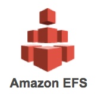
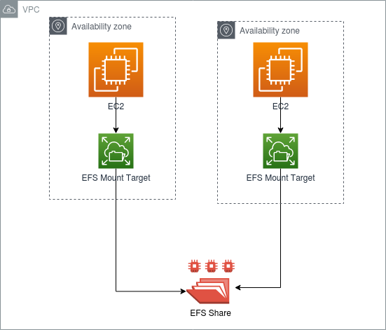

--> [AWS](/00-Intro/AWS.md)  -  [Storage Services](/02-Storage-services/AWS-Storage-Services.md)
# Amazon EFS (Elastic File System)

Amazon EFS è un servizio di **file system completamente gestito**, adatto a workload Linux, per l’uso con istanze [Amazon EC2](/01-Compute-options/Amazon-EC2.md) e altri servizi AWS. Fornisce uno storage condiviso, scalabile e ad alte prestazioni accessibile tramite protocollo **NFSv4**, senza bisogno di provisioning manuale o gestione dell’infrastruttura.

---

## 🔧 Cos'è e come funziona

Amazon EFS consente di creare file system che possono essere **montati contemporaneamente da più istanze EC2**, anche distribuite tra più Availability Zone. 

Il servizio si adatta automaticamente al volume dei dati, riducendo la necessità di pianificare capacità o dimensionamento in anticipo.

Funziona tramite **NFSv4.1 e NFSv4.2**, rendendolo compatibile con sistemi Linux e Unix, e supporta **encryption in-transit e at-rest** tramite [AWS KMS](/09-Sicurezza-Compliance-Governance/Sicurezza/AWS-KMS.md).

NB: **Amazon EFS (Elastic File System)** è un **servizio regionale**: tutti i dati archiviati in un file system EFS e tutte le operazioni effettuate su di esso rimangono all'interno di una singola regione AWS, ma è **accessibile da tutte le AZ della regione**. Un EFS creato in una regione sarà accessibile solo da risorse nella stessa regione (a meno di configurazioni particolari).
A livello regionale, comunque, è garantita alta disponibilità e fault-tolerance, essendo EFS di default replicato tra più AZ nella stessa regione.

---

## ⭐ Caratteristiche principali

- **Storage condiviso:** Accesso simultaneo da migliaia di istanze, anche tra Availability Zone
- **Scalabilità automatica:** Cresce e si riduce dinamicamente in base ai dati archiviati
- **Alta disponibilità:** Progettato per offrire 11 9s (99.999999999%) di durabilità
- **Prestazioni flessibili:** Supporta due modalità di throughput (burst e provisioned)
- **Modalità di storage:**
  - **Standard:** per workload attivi e continui
  - **Infrequent Access (IA):** per file acceduti raramente, a costo ridotto
- **Compatibilità:** NFSv4 per integrazione con ambienti Linux/Unix
- **Sicurezza integrata:** Supporta TLS, [IAM](/09-Sicurezza-Compliance-Governance/Sicurezza/AWS-IAM.md), [Amazon VPC](/03-CDN-e-Networking/Amazon-VPC.md), e crittografia con [AWS KMS](/09-Sicurezza-Compliance-Governance/Sicurezza/AWS-KMS.md)

---
### 🗂️ Classi di storage di Amazon EFS

Amazon EFS offre due principali classi di storage per ottimizzare costi e prestazioni in base al tipo di carico di lavoro:

- **EFS Standard**: progettata per workload attivi e ad alta frequenza di accesso, come applicazioni web, ambienti di sviluppo o container. Offre bassa latenza e throughput elevato.
- **EFS Infrequent Access (EFS IA)**: ideale per file consultati raramente, ma che devono essere comunque rapidamente accessibili quando necessario. Questa classe ha un costo per GB significativamente più basso rispetto a EFS Standard, ma applica una tariffa per ogni accesso ai file.

Per facilitare la gestione dei costi, Amazon EFS include una funzionalità chiamata **EFS Lifecycle Management**, che consente di **trasferire automaticamente i file inattivi** dalla classe EFS Standard a EFS IA dopo un periodo configurabile (ad esempio 7, 14, 30, 60 o 90 giorni di inattività). Questo meccanismo aiuta a ridurre i costi senza compromettere l’accessibilità dei dati, mantenendo al tempo stesso una gestione semplificata dello storage.

---

## 🚀 Casi d'uso

- **Ambienti di sviluppo condivisi:** Es. build system, ambienti [CI/CD](/05-Development-Messaging-Deploying/CI-e-CD.md)
- **Web server e CMS distribuiti:** Hosting condiviso, contenuti statici o dinamici
- **Elaborazione dati e analytics:** Accesso simultaneo per strumenti di analisi
- **Workload di [machine learning](07-IA-ML-Analytics/AI e ML/Machine-Learning.md):** dataset condivisi tra nodi
- **Backup e archiviazione condivisa** tra istanze
- **File system per container:** Utilizzabile con [Amazon ECS](/01-Compute-options/Amazon-ECS.md) e [Amazon EKS](/01-Compute-options/Amazon-EKS.md)

---

## 💰 Pricing

Amazon EFS adotta un **modello di pagamento a consumo**, basato su:

- Spazio utilizzato (GB/mese)
- Modalità di storage: Standard o IA
- Throughput provisionato (se richiesto)
- Eventuali operazioni di backup e replica

⚠️ I file archiviati ma raramente acceduti possono beneficiare del tier **Infrequent Access** per costi inferiori.

---

## 🔐 Sicurezza

- **Crittografia a riposo** e **in transito** (TLS); la crittografia a riposo può essere abilitata al momento della creazione del file system (non è attiva di default), mentre quella in transito è disponibile tramite **TLS** e va configurata lato client.
- **Controllo accessi con IAM:** possibilità di applicare policy su utenti e ruoli
- **Mount target per subnet:** con gestione tramite [Amazon VPC](/03-CDN-e-Networking/Amazon-VPC.md)
- **Audit e monitoraggio:** Integrazione con [Amazon CloudWatch](/08-Auditing-Monitoring-Logging/Amazon-CloudWatch.md) e [AWS CloudTrail](/08-Auditing-Monitoring-Logging/Amazon-CloudTrail.md)

---

## 🔄 Confronto con servizi simili in AWS

| Servizio                  | Tipo di storage           | Quando usarlo                                               |
|---------------------------|---------------------------|-------------------------------------------------------------|
| **Amazon EFS**            | File system condiviso     | Per accesso simultaneo da più istanze EC2                  |
| **[Amazon EBS](/02-Storage-services/Amazon-EBS.md)**            | Storage a blocchi          | Per accesso da una singola istanza, performance elevate     |
| **[Instance Store](/02-Storage-services/Instance-Store.md)**    | Storage locale effimero    | Per dati temporanei e alte prestazioni locali               |
| **[Amazon FSx](/02-Storage-services/Amazon-FSx.md)**            | File system specializzati  | Per ambienti Windows o workload ad alte prestazioni (Lustre) |
| **[Amazon S3](/02-Storage-services/Amazon-S3.md)**              | Object storage             | Per storage scalabile di oggetti, accesso via API           |

---

## 📌 Best Practices

- Utilizzare **IA tiering** per ridurre i costi dei file meno usati
- Isolare il file system con mount target specifici per AZ
- Applicare regole di **backup periodico** con AWS Backup
- Integrare con CloudWatch per monitorare throughput e I/O
- Assicurarsi che il filesystem sia configurato per il **failover multi-AZ**

---

Amazon EFS è ideale per applicazioni che richiedono un **file system distribuito, scalabile e affidabile**, soprattutto in contesti multi-istanza, containerizzati o ad accesso simultaneo.
