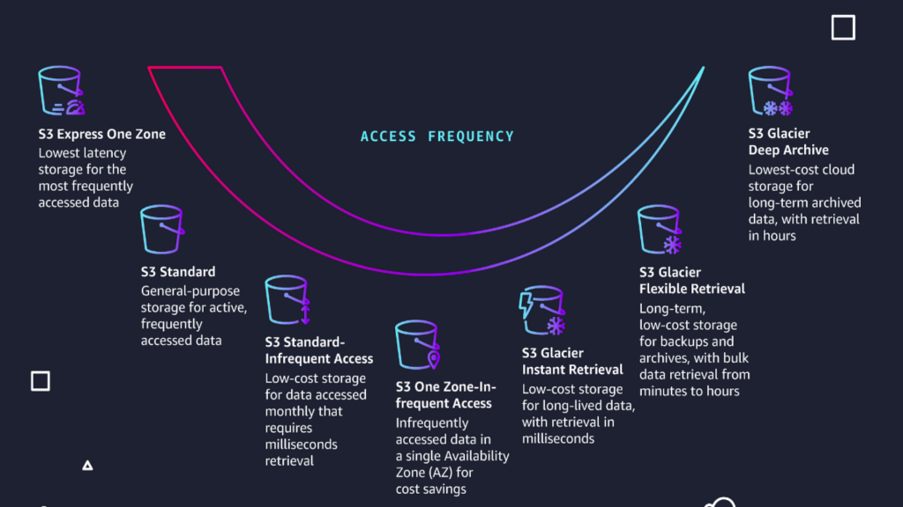

--> [AWS](/00-Intro/AWS.md)  -  [Storage Services](/02-Storage-services/AWS-Storage-Services.md)
# Amazon S3 (Simple Storage Service)

Amazon S3 è un servizio di **object storage** progettato per archiviare e recuperare qualsiasi quantità di dati da qualsiasi luogo su Internet. È altamente scalabile, durevole e usato come base per la maggior parte delle architetture cloud moderne.

Ogni oggetto è composto da dati, una **chiave univoca** e metadati, ed è immagazzinato all’interno di un **bucket**, che funge da contenitore logico.

---

## ⭐ Caratteristiche principali

- **Storage di oggetti:** I dati sono memorizzati come oggetti in bucket, ciascuno con una chiave univoca e metadati personalizzati
- **Versatilità:** Può contenere file, immagini, video, backup, log, dataset e altro
- **Durabilità:** 99.999999999% (11 9s), ottenuta tramite replica automatica su più dispositivi in almeno tre Availability Zone nella stessa regione, di default. Se invece vuoi che gli oggetti siano replicati in un'altra regione AWS, devi abilitare *manualmente* la funzionalità chiamata **CRR (Cross-Region Replication)**
- **Scalabilità automatica:** Lo storage cresce automaticamente con il volume dei dati, senza limiti o provisioning
- **Prestazioni elevate:** Progettato per throughput elevato e bassa latenza
- **Sicurezza avanzata:**
  - Controllo accessi tramite [IAM](/09-Sicurezza-Compliance-Governance/Sicurezza/AWS-IAM.md), bucket policy e ACL
  - Crittografia a riposo (SSE-S3, SSE-KMS) e in transito (TLS)
- **Versioning:** Mantiene versioni multiple di uno stesso oggetto per prevenire perdite accidentali
- **Lifecycle policies:** Permette di automatizzare la transizione tra classi di storage o l’eliminazione degli oggetti con [S3 Lifecycle](/10-Prezzo-Fatturazione-Supporto/S3-Lifecycle.md) e/o [S3 Intelligent-Tiering](/10-Prezzo-Fatturazione-Supporto/S3-Intelligent-Tiering.md)

---

## 🧱 Classi di storage

| Classe                          | Descrizione                                                                                  | Casi d’uso principali                                   |
|----------------------------------|----------------------------------------------------------------------------------------------|--------------------------------------------------------|
| **S3 Express One Zone**       | Archiviazione ad **altissima performance**, **bassa latenza** e costi contenuti, in una sola AZ | Analisi near real-time, data lake, applicazioni AI/ML |
| **S3 Standard**                | Per dati ad accesso frequente, alta disponibilità e throughput                               | Dati applicativi, hosting statico                      |
| **[S3 Intelligent-Tiering](/10-Prezzo-Fatturazione-Supporto/S3-Intelligent-Tiering.md)** | Ottimizza i costi analizzando i pattern di accesso                                        | Dati con accesso imprevedibile                         |
| **S3 Standard-IA**             | Per dati acceduti raramente ma che devono essere recuperati rapidamente                     | Backup operativi, archiviazione di breve termine       |
| **S3 One Zone-IA**            | Come Standard-IA ma replicato in una sola AZ                                                 | Backup secondari, dati facilmente rigenerabili         |
| **S3 Glacier Instant Retrieval** | Per archiviazione con accesso in millisecondi                                              | Archiviazione attiva a basso costo                     |
| **S3 Glacier Flexible Retrieval** | Per archiviazione a lungo termine con recupero da minuti a ore                          | Dati consultati raramente ma con necessità di accesso  |
| **S3 Glacier Deep Archive**   | Per archiviazione a lunghissimo termine con accesso fino a 12h                              | Conservazione a norma di legge, backup storico         |

---

## 🚀 Casi d’uso

- Backup e archiviazione dati aziendali
- Hosting di siti statici (integrazione con [Amazon CloudFront](/03-CDN-e-Networking/Amazon-CloudFront.md))
- Data lake per analisi e big data
- Distribuzione di contenuti multimediali (immagini, video, PDF, ecc.)
- Archiviazione log, dati applicativi e analytics
- Permettere il download di singoli oggetti tramite URL a loro assegnato

---

## 🔗 Integrazioni

- **[Amazon CloudFront](/03-CDN-e-Networking/Amazon-CloudFront.md):** Distribuzione globale tramite Content Delivery Network
- **[Amazon Athena](/07-IA-ML-Analytics/Analytics/Amazon-Athena.md):** Query SQL serverless direttamente sui dati in S3
- **[AWS Glue](/07-IA-ML-Analytics/Analytics/AWS-Glue.md):** ETL automatizzato e catalogazione dei dati
- **[AWS Lambda](/01-Compute-options/AWS-Lambda.md):** Esecuzione di codice in risposta a eventi S3 (es. upload)
- **[AWS Backup](/02-Storage-services/AWS-Backup.md):** Gestione centralizzata del backup anche su S3 Glacier

---

##  Vantaggi

- **Estrema affidabilità e resilienza**
- 💰 **Modello di pricing pay-per-use:** pagamento solo per ciò che si utilizza
- **Integrazione nativa con l’ecosistema AWS**
- **API RESTful** semplici, potenti e standardizzate

---

## 🔐 Sicurezza

- **IAM policies** per controllo granulare degli accessi
- **Bucket policy** e **ACL** per configurazioni personalizzate
- **Crittografia automatica dei dati a riposo** (SSE-S3, SSE-KMS)
- **Crittografia in transito** con SSL/TLS sia server-side che client-side
- **Logging, monitoraggio e auditing:** integrazione con [Amazon CloudWatch](/08-Auditing-Monitoring-Logging/Amazon-CloudWatch.md) e [AWS CloudTrail](/08-Auditing-Monitoring-Logging/Amazon-CloudTrail.md)

---

## 🔄 Confronto con storage per EC2

| Tipo di storage             | Quando usarlo                                                      |
|----------------------------|---------------------------------------------------------------------|
| **Amazon S3**              | Object storage per dati non strutturati o condivisi via API        |
| **[Amazon EBS](/02-Storage-services/Amazon-EBS.md)**         | Storage a blocchi per singole istanze EC2                        |
| **[Amazon EFS](/02-Storage-services/Amazon-EFS.md)**         | File system NFS per accesso simultaneo da più istanze EC2       |
| **[Instance Store](/02-Storage-services/Instance-Store.md)** | Storage temporaneo e locale legato alla durata dell’istanza     |

➡️ Vedi anche: [EC2-storage-vs-S3-storage](/02-Storage-services/EC2-storage-vs-S3-storage.md)

---
### S3 Transfer Acceleration

S3 Transfer Acceleration è una funzionalità di Amazon S3 che consente di aumentare significativamente la velocità di upload e download di file, in particolare per utenti geograficamente lontani dal bucket. 
Utilizza la [rete globale AWS](/03-CDN-e-Networking/Rete-globale-AWS.md) e il servizio [Amazon CloudFront](/03-CDN-e-Networking/Amazon-CloudFront.md) per instradare i dati attraverso edge location distribuite globalmente, riducendo la latenza. 
È ideale per applicazioni con utenti internazionali o per il trasferimento di file di grandi dimensioni.
Transfer Acceleration porta benefici al trasferimento di dati verso e da S3 in termini di velocità, facilità, e sicurezza.

### Multipart Upload

La funzionalità di **Multipart Upload** in Amazon S3 consente di caricare file di grandi dimensioni suddividendoli in più parti, che vengono caricate in parallelo. 
Questo approccio migliora l'affidabilità e le prestazioni del trasferimento, soprattutto in presenza di file di dimensioni superiori a 100 MB. 
Ogni parte può essere caricata, riavviata o ritentata individualmente, rendendo il processo più resiliente a errori di rete. Una volta completato l’upload di tutte le parti, S3 le unisce in un unico oggetto finale. 
È una best practice consigliata per oggetti superiori a 100 MB ed è obbligatoria per quelli oltre 5 GB.

---

Amazon S3 è uno dei servizi **più fondamentali e versatili di AWS**, adatto a ogni esigenza di storage nel cloud: scalabile, sicuro, economico e integrabile ovunque.
