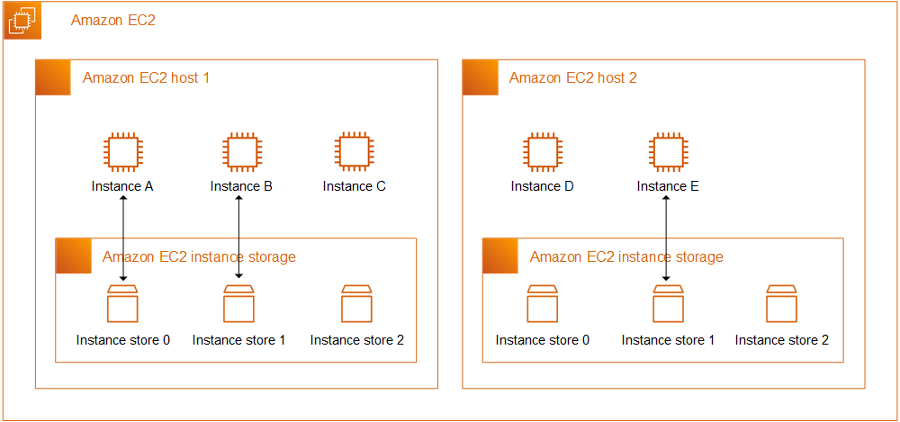

--> [AWS](/00-Intro/AWS.md)  -  [Storage Services](/02-Storage-services/AWS-Storage-Services.md)
# EC2 Instance Store

L'**Instance Store** di [Amazon EC2](/01-Compute-options/Amazon-EC2.md) fornisce uno **storage temporaneo** basato su dischi fisici locali collegati al server host. È pensato per dati **transitori e ad alta velocità**, ma **non è persistente**: i dati vengono persi quando l'istanza viene arrestata o terminata.

---

## 🔧 Cos'è e come funziona

- L’Instance Store utilizza **dischi locali fisici** montati direttamente sul server che ospita l’istanza.
- Instance Store non è condivisibile tra più istanze, essendo uno storage temporaneo fisico direttamente collegato all’hardware del server che ospita l’istanza EC2
- I dati **non sopravvivono** all’arresto o terminazione dell’istanza.
- L’accesso è estremamente veloce grazie alla **bassa latenza** e all’**alta I/O performance**.
- Disponibile solo in **specifici tipi di istanze** EC2, come `i3`, `d2`, `c5d`, `m5d`.

---

## ⭐ Caratteristiche principali e vantaggi

- **Storage temporaneo ma ad alte prestazioni**
- **Incluso nel prezzo** di alcune istanze EC2 (nessun costo aggiuntivo)
- **Altissimo throughput e bassa latenza**
- Ideale per **applicazioni I/O intensive**
- Nessuna configurazione necessaria: disponibile subito al lancio dell’istanza

---

## 🚀 Use Cases

- **Cache temporanee** e buffer locali
- **Storage intermedio** per elaborazione o streaming dati
- **Applicazioni distribuite** come Hadoop che replicano i dati
- **Workload effimeri** o transitori (es. file temporanei)
- **Dati rigenerabili** o replicabili facilmente
- **Veloci scritture e cancellazioni** in grandi volumi

---

## 💰 Pricing

- Instance Store **non ha un prezzo dedicato**: è incluso nel costo delle istanze EC2 che lo supportano.
- Non è disponibile come servizio autonomo: va scelto in base al tipo di istanza.

---

## 🔐 Sicurezza

- **I dati non persistono**: attenzione a non archiviare informazioni critiche senza backup.
- Accessi e permessi vanno comunque gestiti tramite [IAM](/09-Sicurezza-Compliance-Governance/Sicurezza/AWS-IAM.md) e [Amazon VPC](/03-CDN-e-Networking/Amazon-VPC.md).
- Nessun supporto nativo alla crittografia come [Amazon EBS](/02-Storage-services/Amazon-EBS.md), ma è possibile usare filesystem cifrati.

---

## 🔄 Confronto con servizi simili in AWS

| Caratteristica                  | Instance Store                    | [Amazon EBS](/02-Storage-services/Amazon-EBS.md)                         |
|----------------------------------|------------------------------------|-----------------------------------------------------|
| **Persistenza**                | ❌ No                               | ✅ Sì                                                |
| **Performance I/O**           | 🔼 Estremamente elevata             | 🔼 Elevata (dipende dal tipo di volume)             |
| **Montabile su più istanze**  | ❌ No                               | ❌ No                                                |
| **Disponibilità**             | Solo su istanze specifiche         | Su qualsiasi istanza EC2                           |
| **Snapshot/backup**           | ❌ Manuale                          | ✅ Manuale o Integrato con [AWS Backup](/02-Storage-services/AWS-Backup.md)        |
| **Crittografia integrata**    | ❌ No                               | ✅ Sì (tramite [AWS KMS](/09-Sicurezza-Compliance-Governance/Sicurezza/AWS-KMS.md))               |

---

## ⚠️ Considerazioni

- Non adatto per applicazioni mission-critical che richiedono persistenza.
- Richiede una gestione consapevole: **nessuna tolleranza alla perdita dei dati**.
- In scenari ad alte prestazioni, può **ottimizzare costi e velocità**.

---

**Instance Store** è una scelta efficace per workload specifici in cui le **prestazioni sono prioritarie** e la **persistenza non è necessaria**. Richiede però una buona strategia di gestione e backup.
