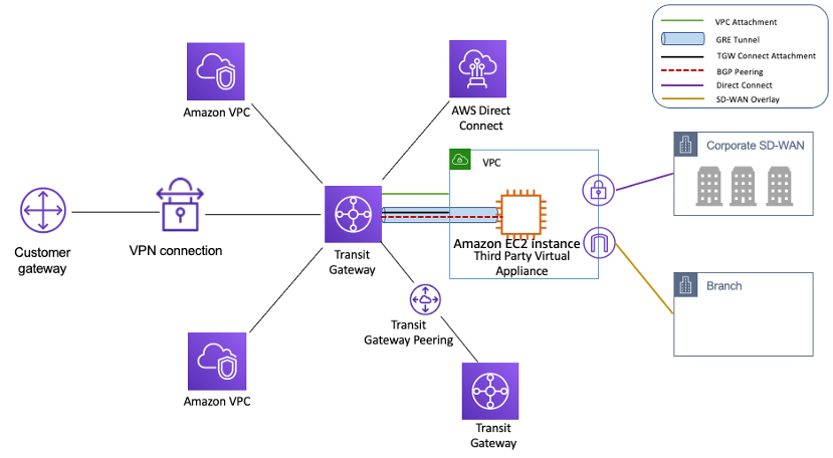

--> [AWS](/00-Intro/AWS.md)  -  [CDN e Networking](/03-CDN-e-Networking/Rete-globale-AWS.md)
# 🌐 AWS Transit Gateway

## 📘 Cos'è e come funziona

**AWS Transit Gateway** è un servizio di rete che consente di connettere più **VPC** (Virtual Private Cloud), **reti on-premises** e altri **servizi AWS** tramite un **hub centrale**, semplificando la gestione della connettività e migliorando la scalabilità della rete. Agisce come un **router cloud-scalabile**, riducendo il numero di connessioni punto-punto necessarie tra VPC e VPN.

Con Transit Gateway, ogni VPC o connessione esterna si collega una sola volta al gateway, che poi instrada il traffico in modo centralizzato.

**AWS Transit Gateway** può connettere fino a **5.000 VPC** per ogni Transit Gateway

---

## ✨ Caratteristiche principali

- 🔁 **Hub-and-spoke networking**: semplifica la rete rispetto a connessioni mesh complesse
- 🌍 **Supporto per VPC, Direct Connect, VPN e peering interregionale**
- 📈 **Scalabilità automatica** per milioni di pacchetti al secondo
- 🔐 **Controllo del routing** tramite tabelle di route personalizzate per ciascun attachment
- 🔄 **Condivisione con AWS Organizations** per un'unica configurazione tra più account
- 📊 **Monitoraggio con CloudWatch** e **logging VPC flow** abilitato
- 🛡️ Supporta **Network Firewall** per filtrare il traffico centralmente

---

## 🚀 Use case comuni

- Interconnessione tra decine o centinaia di VPC
- Architetture multi-account centralizzate
- Espansione di ambienti ibridi (cloud + on-premise)
- Applicazioni distribuite su più regioni
- Centralizzazione del traffico per ispezione, logging o sicurezza

---

## 💰 Pricing

Il costo di AWS Transit Gateway dipende da:

- **Costo per attachment attivo** (es. ogni VPC collegato)
- **Costo per GB trasferito** attraverso il gateway

Il prezzo può variare anche in base alla **regione**. Il traffico inter-regionale ha un costo aggiuntivo.

---

## ✅ Vantaggi

- ✅ **Semplifica** la topologia della rete aziendale
- ✅ Riduce il numero di connessioni necessarie
- ✅ **Centralizza la sicurezza, il routing e la visibilità**
- ✅ Favorisce una **governance efficace** in ambienti multi-account
- ✅ Supporta ambienti **ibridi** e **multiregione**

---

## 📌 Conclusione

**AWS Transit Gateway** è la soluzione ideale per le organizzazioni che crescono in scala, distribuiscono i loro carichi di lavoro in ambienti multi-account e necessitano di **connettività cloud ibrida e controllata**. Fornisce una rete moderna, centralizzata, scalabile e più facile da gestire rispetto ai modelli VPC-to-VPC tradizionali.

> “Con Transit Gateway, la rete cloud non è più un vincolo, ma un abilitatore dell’architettura.”

