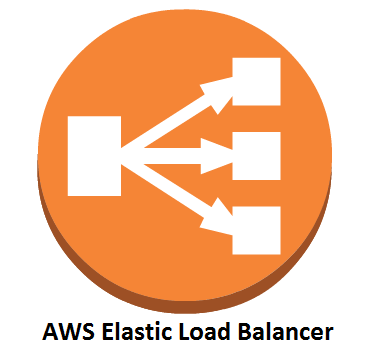

--> [AWS](/00-Intro/AWS.md)  -  [CDN e Networking](/03-CDN-e-Networking/Rete-globale-AWS.md)
# ⚖️ Amazon ELB (Elastic Load Balancing)

## 📘 Cos'è e come funziona

**Amazon ELB** è un servizio gestito che distribuisce automaticamente il traffico di rete o applicativo in ingresso su più istanze Amazon EC2, container (ECS/Fargate), IP, Lambda o microservizi in generale. Migliora la disponibilità e l’affidabilità delle applicazioni, rilevando automaticamente istanze non funzionanti e reindirizzando il traffico a quelle sane.

ELB si integra facilmente con altri servizi AWS, è scalabile automaticamente, e offre bilanciamento a livello di trasporto (TCP) o applicativo (HTTP/HTTPS).

---

## ✨ Caratteristiche principali

- ⚙️ **Distribuzione automatica del traffico** tra risorse backend
- 🧠 **Health check automatici** delle istanze per garantire alta disponibilità
- 📈 **Scalabilità automatica** in base al traffico
- 🔐 **Supporto HTTPS/TLS**, integrazione con AWS Certificate Manager
- 🔄 **Integrazione con Auto Scaling, ECS, Lambda e VPC**
- 📊 **Metriche e logging via CloudWatch, access logs e X-Ray**

---

## 🔀 Tipi di Load Balancer

- **Application Load Balancer (ALB)**  
  Bilanciamento **a livello 7** (HTTP/HTTPS), ideale per applicazioni web, routing avanzato e microservizi. Distribuisce il traffico a target groups basandosi su regole applicative predefinite. Per esempio, può essere usato per instradare richieste a seconda del pattern di URL nella richiesta (Path-based).

- **Network Load Balancer (NLB)**  
  Bilanciamento **a livello 4** (TCP/UDP), ultra-performante e a bassa latenza, ideale per traffico elevato, distribuisce il traffico basandosi su variabili di rete come IP e porte.

- **Gateway Load Balancer (GWLB)**  
  Bilanciamento per appliance virtuali di sicurezza e analisi (firewall, IDS, ecc.)

- **Classic Load Balancer (CLB)** *(legacy)*  
  Supporta sia livello 4 che 7 e distribuisce il traffico in modo equo. Tuttavia, è in fase di dismissione

---

## 🚀 Use case comuni

- Applicazioni web distribuite ad alta disponibilità  
- Architetture a microservizi o API Gateway  
- Applicazioni TCP-heavy con NLB (es. VoIP, streaming)  
- Integrazione con Lambda per serverless backends  
- Routing basato su path, header, host o query string

---

## 💰 Pricing

Amazon ELB prevede un costo per:

- Il **tempo di utilizzo** del Load Balancer (€/ora)  
- Il **volume di traffico elaborato** (GB trasferiti)  
- Log opzionali su S3 e metrica su CloudWatch (a consumo)

I costi variano leggermente tra ALB, NLB e GWLB.

---

## ✅ Vantaggi

- ✅ Alta disponibilità e fault tolerance  
- ✅ Nessuna gestione manuale: è completamente gestito da AWS  
- ✅ Supporto nativo per autoscaling  
- ✅ Integrazione con certificati SSL/TLS  
- ✅ Protezione tramite **AWS WAF** (per ALB)  
- ✅ Sicurezza e monitoraggio centralizzati

---

## 📌 Conclusione

**Amazon ELB** è una componente essenziale per la resilienza e scalabilità di architetture moderne su AWS. Automatizza la distribuzione del traffico e isola gli errori, migliorando l’esperienza utente e riducendo i rischi operativi.

> “Con ELB puoi gestire milioni di richieste al secondo senza preoccuparti dell’infrastruttura sottostante.”

