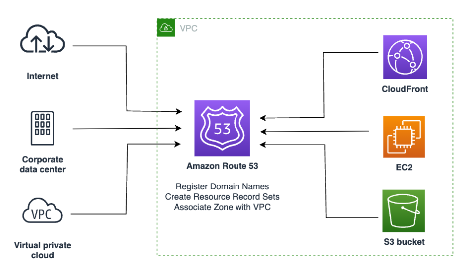

--> [AWS](/00-Intro/AWS.md)  -  [CDN e Networking](/03-CDN-e-Networking/Rete-globale-AWS.md)
# Amazon Route 53

**Amazon Route 53** è il servizio [Domain Name System](/03-CDN-e-Networking/Domain-Name-System.md) gestito di AWS. Il suo nome deriva dalla porta **53**, utilizzata dal protocollo DNS. Route 53 consente di **registrare domini, risolvere nomi DNS** e **instradare traffico in modo intelligente** su scala globale.

Utilizza strategie avanzate di routing, come:
- **Simple routing**: instrada il traffico a un singolo endpoint senza logica condizionale. È la modalità predefinita.
- **Weighted routing**: distribuisce il traffico in base a pesi configurabili tra più risorse, utile per deployment graduali o A/B testing.
- **Latency-based routing**: indirizza gli utenti alla regione AWS con la latenza più bassa per migliorare le prestazioni.
- **Failover routing**: implementa alta disponibilità instradando il traffico verso una risorsa primaria e passando automaticamente a una di backup in caso di failure.
- **Geolocation routing**: indirizza gli utenti in base alla loro posizione geografica (paese, continente o stato negli USA), utile per localizzazione dei contenuti o rispetto di vincoli legali.
- **Geoproximity routing (con traffic flow)**: indirizza il traffico in base alla posizione della risorsa e alla prossimità geografica tra l’utente e la risorsa, con la possibilità di influenzare la distanza effettiva tramite un bias configurabile.
- **Multi-value answer routing**: simile al simple routing, ma può restituire più record IP per una maggiore tolleranza ai guasti (fino a 8 record a rotazione).

---

## 🔍 Cos'è e come funziona

Amazon Route 53 è un servizio DNS autoritativo altamente disponibile e scalabile che collega le richieste degli utenti finali all'infrastruttura AWS o ad altri endpoint, in base a criteri configurabili.

Il servizio include:
- **DNS autoritativo** per la risoluzione dei nomi di dominio.
- **Registrazione di domini** direttamente da AWS.
- **Instradamento avanzato del traffico** per ottimizzare la latenza, la disponibilità o il bilanciamento.

---

## ⚙️ Caratteristiche principali e vantaggi

### DNS ad alte prestazioni
- Traduzione rapida e sicura dei nomi in indirizzi IP.
- Bassa latenza grazie alla [rete globale AWS](/03-CDN-e-Networking/Rete-globale-AWS.md).

### Registrazione di domini
- Acquisto e gestione di domini direttamente da AWS.
- Supporto per numerosi TLD.

### Traffic Flow intelligente
- **Geolocalizzazione**: invia il traffico all'endpoint più vicino geograficamente.
- **Latency-based routing**: minimizza la latenza percepita dall'utente.
- **Weighted routing**: distribuisce traffico tra endpoint con percentuali.
- **Failover**: garantisce continuità operativa automatica.
- **Multi-value answer**: semplice load balancing DNS.

### Integrazione nativa
- Con servizi come [Amazon EC2](/01-Compute-options/Amazon-EC2.md), [Amazon S3](/02-Storage-services/Amazon-S3.md), [Amazon CloudFront](/03-CDN-e-Networking/Amazon-CloudFront.md), [Elastic Load Balancing](/03-CDN-e-Networking/Amazon-ELB.md).
- Compatibile con controlli di salute (health check) e [CloudWatch](/08-Auditing-Monitoring-Logging/Amazon-CloudWatch.md).

### Supporto Alias Record
- Redirezione compatibile con root domain (non possibile con un classico CNAME).

### DNSSEC (facoltativo)
- Firma digitale dei record DNS per proteggere da modifiche non autorizzate.

---

## 💡 Use cases

- Gestione DNS per siti web, API e servizi cloud-native.
- Routing geografico per applicazioni multi-regione.
- Failover automatico tra risorse in ambienti HA.
- Hosting di DNS privati per [Amazon VPC](/03-CDN-e-Networking/Amazon-VPC.md).
- Routing dinamico tra ambienti dev, test e produzione.
- Ottimizzazione delle performance con routing a bassa latenza.

---

## 💰 Pricing

Il costo di Route 53 si basa su:
- **Numero di hosted zones** attive.
- **Numero di query DNS** elaborate (per tipo).
- **Query di health check**.
- **Registrazione e rinnovo domini** (variabile per TLD).
- Funzionalità come **Traffic Flow** e **DNSSEC** hanno costi aggiuntivi.

È disponibile anche un livello gratuito limitato per uso base.

---

## 🔐 Sicurezza

- Supporta **DNSSEC** per la protezione dei record DNS.
- Integrazione con [IAM](/09-Sicurezza-Compliance-Governance/Sicurezza/AWS-IAM.md) per la gestione degli accessi.
- Log accessibili tramite [CloudWatch](/08-Auditing-Monitoring-Logging/Amazon-CloudWatch.md).
- Gestione delle risorse tramite autorizzazioni granulari.

---

## 🔄 Confronto con servizi simili in AWS

| Servizio                             | Scopo                                           | Differenze con Route 53                                      |
|--------------------------------------|--------------------------------------------------|---------------------------------------------------------------|
| [Amazon CloudFront](/03-CDN-e-Networking/Amazon-CloudFront.md) | Content Delivery Network (CDN)                   | Route 53 si occupa della risoluzione DNS, CloudFront distribuisce contenuti |
| [AWS Global Accelerator](/03-CDN-e-Networking/AWS-Global-Accelerator.md) | Ottimizzazione routing TCP/IP globale             | Global Accelerator lavora su livelli IP, Route 53 a livello DNS |
| [AWS Direct Connect](/03-CDN-e-Networking/AWS-Direct-Connect.md)       | Connessione fisica tra data center e AWS         | Route 53 è DNS, non gestisce connessioni fisiche |

---

## ✅ Conclusione

Amazon Route 53 è molto più di un semplice resolver DNS. È una **piattaforma DNS scalabile, intelligente e integrata**, perfetta per chi vuole massimizzare **affidabilità, performance e flessibilità** nel routing del traffico in ambiente AWS e oltre.
