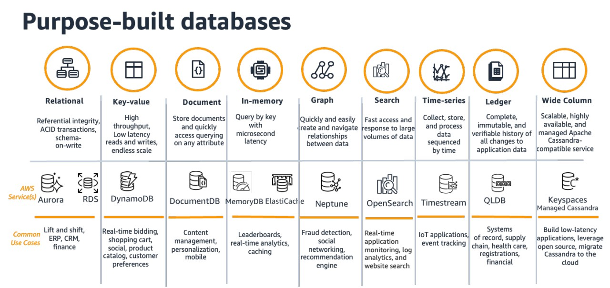
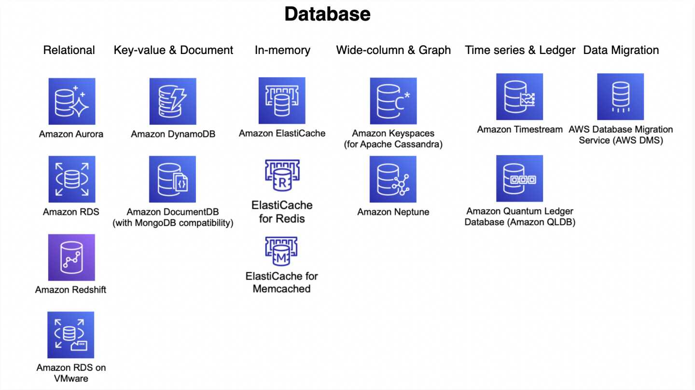

--> [AWS](/00-Intro/AWS.md)
# Panoramica dei Servizi Database di AWS

AWS offre una vasta gamma di servizi di **database gestiti**, progettati per soddisfare esigenze differenti in termini di struttura dei dati, scalabilità, prestazioni e gestione.

## Categorie principali

### 1. **Database relazionali**

- Basati su tabelle, con supporto per SQL.
- Utili per applicazioni transazionali strutturate.
- Servizi principali: 
	- [Amazon RDS](/04-Database-services/Amazon-RDS.md) (supporta MySQL, PostgreSQL, SQL Server, Oracle, MariaDB, Aurora).
	- [Amazon Aurora](/04-Database-services/Amazon-Aurora.md) (compatibile con MySQL e PostgreSQL)
    
### 2. **Database NoSQL**

- Progettati per flessibilità e scalabilità.
- Non richiedono uno schema fisso.
- Servizio principale: 
	- [Amazon-DynamoDB](/04-Database-services/Amazon-DynamoDB.md).
	- Amazon Keyspaces (compatibile con Apache Cassandra)
    

### 3. **Database in-memory**

- Ottimizzati per bassa latenza e alta velocità.
- Servizi principali:
	- **[Amazon ElastiCache](/04-Database-services/Amazon-ElastiCache.md)** (Redis, Memcached).
	- **[Amazon MemoryDB for Redis](/04-Database-services/Amazon-MemoryDB-for-Redis.md)**

### 4. **Database grafici**

- Progettati per gestire relazioni complesse tra dati.
- Servizio: **[Amazon-Neptune](/04-Database-services/Amazon-Neptune.md)**.

### 5. **Database per analisi**

- Ottimizzati per query complesse su grandi volumi di dati.
- Servizio principale: **[Amazon Redshift](/07-IA-ML-Analytics/Analytics/Amazon-Redshift-e-Redshift-Serverless.md)** (Data Warehouse).

### 6. **Database per ledger (immutabilità)**

- Usati per registri trasparenti e verificabili.
- Servizio: **Amazon QLDB** (Quantum Ledger Database).

### 7. **Database time-series**

- Ottimizzati per dati temporali.
- Servizio: **Amazon Timestream**.

    

## Vantaggi dei database AWS

- Scalabilità automatica
- Alta disponibilità
- Backup, ripristino e sicurezza gestiti
- Integrazione con l'intero ecosistema AWS

Con AWS è possibile scegliere il tipo di database più adatto in base al carico di lavoro, al modello di dati e ai requisiti di performance.

## AWS Database Migration Service

Per completare la panoramica dei servizi database offerti da AWS, è fondamentale considerare **[AWS-Database-Migration-Service](/04-Database-services/AWS-Database-Migration-Service.md)**. Questo servizio gestito facilita la migrazione di database relazionali, NoSQL e data warehouse verso AWS o tra ambienti on-premise e cloud, garantendo un downtime minimo. AWS DMS supporta sia migrazioni omogenee (stesso motore di database) che eterogenee (motori diversi), offrendo funzionalità di replica continua per mantenere sincronizzati i dati tra origine e destinazione. Grazie alla sua compatibilità con una vasta gamma di motori, tra cui Oracle, SQL Server, PostgreSQL, MySQL, MongoDB e Amazon Redshift, AWS DMS rappresenta una soluzione versatile per le esigenze di migrazione dei dati .