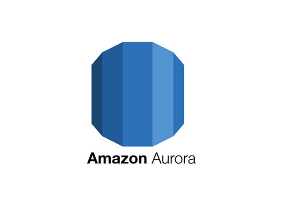

--> [AWS](/00-Intro/AWS.md)  -  [Database Services](/04-Database-services/AWS-Databases.md)

# 🌟 Amazon Aurora

## 📘 Cos'è e come funziona

**Amazon Aurora** è un database relazionale compatibile con **MySQL** e **PostgreSQL**, progettato da [AWS](/00-Intro/AWS.md) per offrire **prestazioni superiori**, **alta disponibilità** e scalabilità automatica, mantenendo la semplicità d'uso dei motori open-source. 

È un servizio **completamente gestito**, che rientra nella famiglia [Amazon-RDS](/04-Database-services/Amazon-RDS.md), ma con architettura, **prestazioni** e **availability** significativamente migliorate, adatto specificatamente a applicazioni di larga scala e critiche (come l'e-commerce)

Aurora è costruito su uno **storage distribuito e auto-riparante**, con replica automatica su più (3 di default) Availability Zone (Multi-AZ) e supporto per il failover in pochi secondi.

---

## ✨ Caratteristiche principali e vantaggi

- ⚡ **Prestazioni elevate**: fino a 5 volte più veloce di MySQL e 3 volte più veloce di PostgreSQL
- 🔄 **Compatibilità open-source**: si utilizza con driver e strumenti MySQL/PostgreSQL
- 🧩 **Scalabilità automatica dello storage**: fino a 128 TB per database
- 🛡️ **Alta disponibilità**: supporto automatico Multi-AZ, backup continui e failover automatico
- 📖 **Replica Aurora**: letture scalabili con fino a 15 repliche ad alte prestazioni
- 🧠 **Machine Learning integrato**: integrazione con Amazon SageMaker e Comprehend
- 🔐 **Sicurezza**: crittografia con [AWS-KMS](/09-Sicurezza-Compliance-Governance/Sicurezza/AWS-KMS.md), [AWS-IAM](/09-Sicurezza-Compliance-Governance/Sicurezza/AWS-IAM.md), [Amazon-VPC](/03-CDN-e-Networking/Amazon-VPC.md), auditing e TLS

---

## 🚀 Use case comuni

- Applicazioni web e mobile con requisiti elevati di latenza e scalabilità
- Sistemi di gestione ERP e CRM
- Analytics e business intelligence su dati transazionali
- Servizi SaaS ad alta disponibilità
- Migrazione da database open-source con necessità di scalabilità

---

## 💰 Pricing

Aurora si basa su un modello **pay-as-you-go** per:

- **Istanza database**: in base al tipo e alla dimensione dell’istanza
- **Storage utilizzato**: paghi solo per i GB effettivi, con espansione automatica
- **I/O Operations**: costi in base al numero di letture/scritture
- **Backup**: incluso fino alla dimensione dello storage, poi a consumo
- **Aurora Serverless** (v2): si paga per secondi di utilizzo (ACU - Aurora Capacity Unit)

---

## 🔄 Confronto con servizi simili in AWS

| Servizio               | Gestito | Compatibilità      | Prestazioni | Auto-scaling | Use case principale                  |
|------------------------|---------|---------------------|-------------|--------------|--------------------------------------|
| **Amazon Aurora**      | ✅      | MySQL, PostgreSQL   | 🔥 Alta     | ✅            | App scalabili e critiche             |
| [Amazon-RDS](/04-Database-services/Amazon-RDS.md)        | ✅      | MySQL, PostgreSQL, Oracle, SQL Server, MariaDB | 🔹 Standard | ❌ (parziale) | App tradizionali e migrazioni        |
| [Amazon-DynamoDB](/04-Database-services/Amazon-DynamoDB.md)    | ✅      | NoSQL               | ⚡ Estreme   | ✅            | App serverless, real-time, IoT       |
| [Amazon-Redshift](/07-IA-ML-Analytics/Analytics/Amazon-Redshift-e-Redshift-Serverless.md)    | ✅      | SQL (analitico)     | 🔸 Ottime    | ✅            | DWH, BI, big data                    |

**Aurora** è ideale quando servono le funzionalità relazionali SQL **con prestazioni elevate, replica rapida e alta disponibilità**, senza i limiti delle soluzioni open-source standard.

---

## 📌 Conclusione

**Amazon Aurora** unisce il meglio del mondo open-source con l’affidabilità e la scalabilità dell’infrastruttura [AWS](/00-Intro/AWS.md). È una scelta perfetta per applicazioni **mission-critical** che richiedono **alte prestazioni, resilienza e scalabilità automatica**, con la semplicità d’uso di MySQL o PostgreSQL.

> “Aurora è come MySQL, ma progettato per il cloud: più veloce, più sicuro, più affidabile.”
