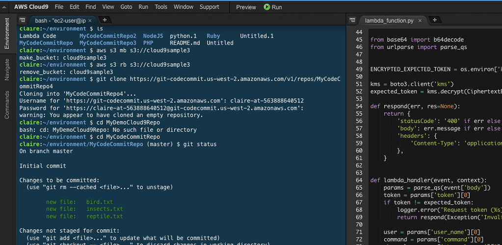

--> [AWS](/00-Intro/AWS.md)  -  [Development, Messaging, and Deployment](/05-Development-Messaging-Deploying/Development-Messaging-and-Deployment.md)
# AWS Cloud9

**AWS Cloud9** è un ambiente di sviluppo integrato (IDE) basato su cloud, accessibile tramite browser. Include un editor di codice, un terminale e un debugger completamente configurati per lo sviluppo in linguaggi come JavaScript, Python, PHP, Go, C++, e molti altri.

---

## 🧩 Caratteristiche principali

- **IDE completo su browser**: scrivi, esegui e debugga codice senza installare nulla localmente.
- **Terminale integrato**: accedi a un terminale Linux con AWS CLI preinstallata.
- **Collaborazione in tempo reale**: più utenti possono lavorare sullo stesso progetto.
- **Integrazione con [AWS](/00-Intro/AWS.md)**: accesso diretto alle risorse tramite CLI o SDK.
- **Configurabile**: puoi scegliere se eseguire Cloud9 su una nuova istanza [Amazon EC2](/01-Compute-options/Amazon-EC2.md) o collegarlo a una tua istanza esistente.

---

## 🚀 Come iniziare

1. Vai alla Console AWS → Servizi → **Cloud9**
2. Clicca su **Create environment**
3. Inserisci un nome e una descrizione
4. Scegli il tipo di ambiente:
   - Nuova istanza [Amazon EC2](/01-Compute-options/Amazon-EC2.md)
   - Istanza EC2 esistente
   - Server remoto tramite SSH
5. Avvia l’ambiente e inizia a scrivere codice nel browser

---

## 💻 Cosa contiene l’ambiente

- **Editor** con supporto per syntax highlighting, IntelliSense, linting
- **Terminale Linux** con accesso root
- **Debugging** con breakpoints, watch expressions, step-by-step
- **Preconfigurato** con:
  - AWS CLI
  - Git
  - Node.js, Python, Java, ecc.
  - Docker client (se abilitato)

---

## 🔐 Sicurezza e IAM

- Cloud9 utilizza un **role [IAM](/09-Sicurezza-Compliance-Governance/Sicurezza/AWS-IAM.md) associato all’istanza EC2**.
- I permessi dell’utente vengono gestiti tramite [AWS IAM](/09-Sicurezza-Compliance-Governance/Sicurezza/AWS-IAM.md).
- È possibile **limitare l’accesso ai file e terminale** tra collaboratori.

---

## 🔄 Collaborazione in tempo reale

- Invita altri utenti AWS a collaborare.
- Tutti vedono e modificano il codice in tempo reale.
- Chat integrata nel workspace.
- Ottimo per pair programming, code review e formazione.

---

## 🛠️ Esempi di uso tipico

- Scrivere e testare codice [AWS Lambda](/01-Compute-options/AWS-Lambda.md)
- Interagire con AWS CLI per gestire risorse
- Creare API con Amazon API Gateway e [AWS Lambda](/01-Compute-options/AWS-Lambda.md)
- Sviluppare applicazioni serverless
- Fare debug su [Amazon EC2](/01-Compute-options/Amazon-EC2.md)

---

## ✅ Best Practices

- Assegna all’istanza EC2 un ruolo [IAM](/09-Sicurezza-Compliance-Governance/Sicurezza/AWS-IAM.md) con i permessi minimi necessari.
- Usa istanze con autospegnimento per evitare costi inutili.
- Salva progetti nella home directory per renderli persistenti.
- Versiona il codice con Git e salva su [AWS CodeCommit](/05-Development-Messaging-Deploying/AWS-CodeCommit.md) o GitHub.

---

## 📌 Conclusioni

AWS Cloud9 è uno strumento potente per sviluppare applicazioni nel cloud senza dover configurare ambienti locali. Grazie all’integrazione con AWS, al supporto multi-linguaggio e alla collaborazione in tempo reale, è ideale per team distribuiti, DevOps, serverless e progetti educativi.
