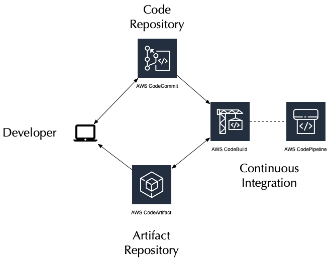
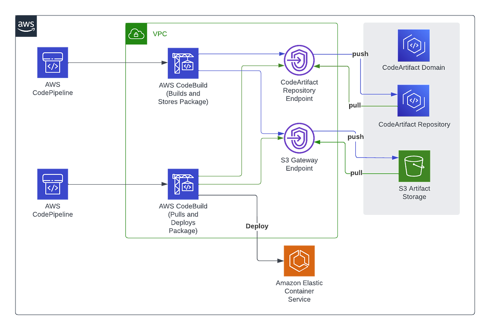

--> [AWS](/00-Intro/AWS.md)  -  [Development, Messaging, and Deployment](/05-Development-Messaging-Deploying/Development-Messaging-and-Deployment.md)
# AWS CodeArtifact

**AWS CodeArtifact** è un servizio di repository di pacchetti completamente gestito che consente ai team di sviluppo di archiviare, pubblicare e condividere pacchetti software utilizzati nei progetti. Supporta formati popolari come Maven, npm, PyPI e NuGet, integrandosi con strumenti di build e [CI/CD](/05-Development-Messaging-Deploying/CI-e-CD.md) esistenti.

CodeArtifact è un servizio di repository di artefatti completamente gestito che rende semplice, per organizzazioni di qualsiasi dimensione, archiviare, pubblicare e condividere in modo sicuro i pacchetti software utilizzati nel processo di sviluppo. Questo include tutto il necessario per costruire la tua applicazione, comprese librerie, pacchetti distribuibili, applicazioni compilate e documentazione relativa alla tua applicazione.



---

## Cos'è un Artifact

- Documentazione  
- Applicazioni compilate  
- Deployable packages  
- Librerie  

---

## 🧩 Caratteristiche principali

- **Repository centralizzato**: per pacchetti interni e di terze parti.
- **Supporta formati standard**: npm, Maven, PyPI, NuGet.
- **Caching dei pacchetti pubblici**: evita download ripetuti da internet.
- **Sicurezza [IAM](/09-Sicurezza-Compliance-Governance/Sicurezza/AWS-IAM.md) integrata**: accesso basato su ruoli e policy.
- **Completamente gestito**: nessun server da mantenere.

Una feature utile è quella che permette di approvare i pacchetti, così che gli sviluppatori possano accedere solo a quelli approvati, quindi alle versioni che devono usare.

---

## 🚀 Come funziona

1. **Crea un dominio CodeArtifact** (spazio logico per uno o più repo).
2. **Crea uno o più repository** nel dominio.
3. **Configura i client di build** (es. npm, pip, mvn) per usare CodeArtifact.
4. **Pubblica pacchetti** personalizzati oppure **scarica pacchetti pubblici** (caching automatico).
5. **Controlla accessi e versioni** dei pacchetti via [IAM](/09-Sicurezza-Compliance-Governance/Sicurezza/AWS-IAM.md) e policy.



---

## 🔄 Integrazione con strumenti

- **npm / Yarn**
- **pip / Poetry**
- **Maven / Gradle**
- **NuGet**
- **Jenkins, GitHub Actions, CodeBuild** e altri strumenti CI/CD

---

## 📦 Esempi di comandi

```bash
# Login npm
aws codeartifact login --tool npm --repository my-repo --domain my-domain --domain-owner <account-id>

# Pubblica un pacchetto npm
npm publish

# Installa pacchetti con pip
pip install <package-name> --extra-index-url https://<domain>-<account-id>.d.codeartifact.<region>.amazonaws.com/pypi/<repo>/simple/
```

---

## 🔐 Sicurezza

- [IAM](/09-Sicurezza-Compliance-Governance/Sicurezza/AWS-IAM.md) per gestire accessi granulari ai repository.
- Policy personalizzate per dominio e repository.
- Integrazione con AWS KMS per la crittografia dei metadati.
- Monitoraggio con CloudTrail e CloudWatch.

---

## ✅ Best Practices

- Usa repository separati per ambienti (dev/test/prod).
- Configura cache automatica per pacchetti pubblici.
- Versiona i pacchetti interni in modo coerente (es. semantic versioning).
- Proteggi i pacchetti critici con policy [IAM](/09-Sicurezza-Compliance-Governance/Sicurezza/AWS-IAM.md) restrittive.
- Automatizza la pubblicazione tramite pipeline CI/CD.

---

## 📌 Conclusioni

AWS CodeArtifact offre un modo sicuro, scalabile e gestito per gestire dipendenze software nei progetti moderni. È utile sia per aziende che vogliono controllare i pacchetti interni, sia per migliorare le prestazioni e la sicurezza evitando dipendenze dirette da repository pubblici.
