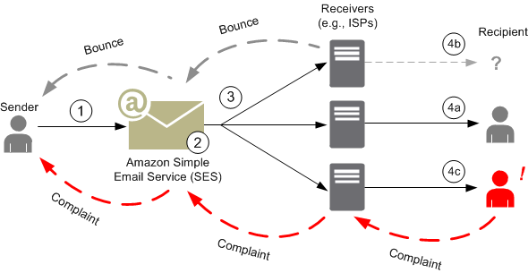
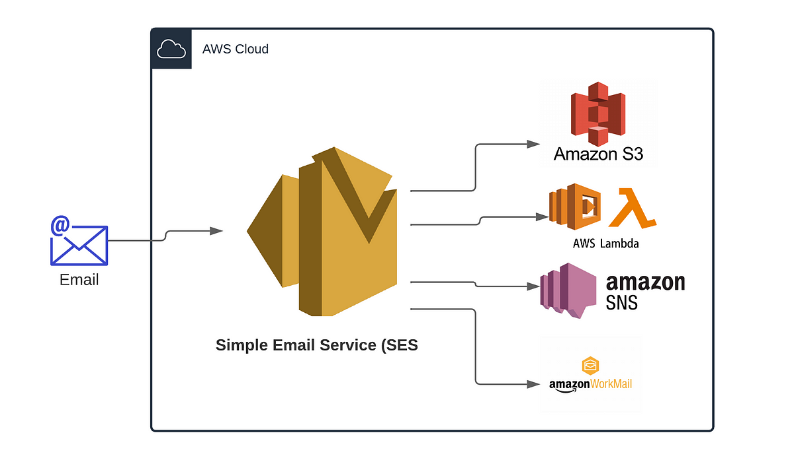
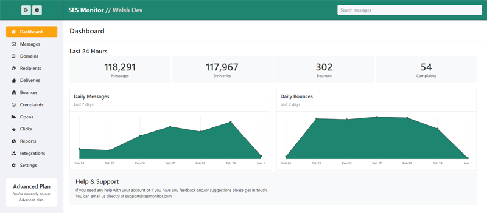

--> [AWS](/00-Intro/AWS.md)  -  [Development, Messaging, and Deployment](/05-Development-Messaging-Deploying/Development-Messaging-and-Deployment.md)
# Amazon Simple Email Service (SES)

**Amazon SES (Simple Email Service)** è un servizio cloud gestito per **invio e ricezione di email**. È progettato per aiutare aziende e sviluppatori a inviare **email di marketing, notifiche e transazionali** in modo scalabile, sicuro e con alti tassi di consegna.



---

## 🧩 Caratteristiche principali

- **Invio di email** transazionali, promozionali e di sistema
- Invio di *Richly Formatted HTML Emails*
- Invio di email in **bulk**
- **Ricezione di email** con filtraggio e instradamento personalizzabile
- **Supporto SMTP e API** per l’integrazione flessibile
- **Monitoraggio** con [Amazon CloudWatch](/08-Auditing-Monitoring-Logging/Amazon-CloudWatch.md) (open rate, bounce, complaint)
- **Gestione della reputazione** e feedback loop
- **Autenticazione**: SPF, DKIM, DMARC
- **Supporta allegati, HTML e testo normale**
- Traccia metriche come open rates e click-through rates, permettendo di valutare l'effettività della campagna mail.




---

## 🚀 Come funziona

1. **Verifica del dominio o email** (per dimostrare la proprietà)
2. **Invio di email** tramite API, SMTP o SDK
3. **Monitoraggio dei risultati**: consegna, errori, bounce, ecc.
4. *(Opzionale)*: **ricezione di email** con instradamento verso [AWS Lambda](/01-Compute-options/AWS-Lambda.md), [Amazon S3](/02-Storage-services/Amazon-S3.md), [Amazon SNS](/05-Development-Messaging-Deploying/Amazon-SNS.md)


---

## 📬 Modalità di invio

### 📡 1. API SES

```bash
aws ses send-email \
  --from "mittente@example.com" \
  --destination "ToAddresses=destinatario@example.com" \
  --message "Subject={Data=Test SES},Body={Text={Data=Hello from SES}}"
```

### 🔐 2. SMTP

- Richiede credenziali SMTP generate tramite [IAM](/09-Sicurezza-Compliance-Governance/Sicurezza/AWS-IAM.md)
- Compatibile con qualsiasi client SMTP (Outlook, Postfix, ecc.)

---

## 🛡️ Sicurezza e autenticazione

- **SPF**: verifica il dominio del mittente
- **DKIM**: firma digitale delle email
- **DMARC**: policy di sicurezza combinata
- **IAM Policies**: per controllare chi può inviare email
- **TLS**: crittografia delle connessioni SMTP

---

## 📈 Monitoraggio e feedback

- **Bounce e complaint notifications** via [Amazon SNS](/05-Development-Messaging-Deploying/Amazon-SNS.md)
- **Statistiche** di invio con [Amazon CloudWatch](/08-Auditing-Monitoring-Logging/Amazon-CloudWatch.md)
- **Feedback loop** automatico per proteggere la reputazione IP

---

## 📦 Casella in sandbox vs produzione

- **Sandbox mode** (default):
  - Puoi inviare solo a email/domìni verificati
  - Serve per testare prima del passaggio alla produzione

- **Produzione**:
  - Nessun limite sui destinatari (salvo limiti account)
  - Richiede richiesta esplicita ad [AWS](/00-Intro/AWS.md)

---

## ✅ Use case

- Email transazionali (conferme ordini, reset password)
- Notifiche di sistema (alert, log, messaggi app)
- Email di marketing (newsletter, promozioni)
- Sistemi automatizzati (via [AWS Lambda](/01-Compute-options/AWS-Lambda.md), cron, [Amazon API Gateway](/Others/Amazon-API-Gateway.md))

---

## ✅ Best Practices

- Verifica sempre i domini e imposta SPF/DKIM/DMARC correttamente
- Gestisci le **complaint** per evitare blacklist
- Usa tag [Amazon CloudWatch](/08-Auditing-Monitoring-Logging/Amazon-CloudWatch.md) per tracciare campagne e gruppi
- Richiedi l'accesso alla **produzione** prima del go-live
- Usa template HTML con fallback in plain text

---

## 📌 Conclusioni

Amazon SES è una soluzione potente ed economica per inviare email in ambienti cloud. È adatta a startup e grandi aziende, grazie alla sua scalabilità, sicurezza e integrazione nativa con altri servizi AWS.

> “Con Amazon SES, le tue email viaggiano nel cloud con affidabilità e controllo.”
