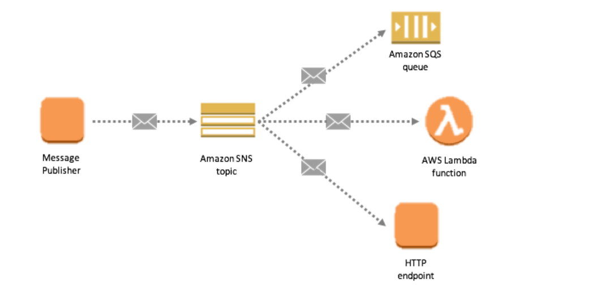

--> [AWS](/00-Intro/AWS.md)  -  [Development, Messaging, and Deployment](/05-Development-Messaging-Deploying/Development-Messaging-and-Deployment.md)
# Amazon Simple Notification Service (SNS)

**Amazon SNS** è un servizio di messaggistica fully-managed che consente il **pub/sub** asincrono tra applicazioni, microservizi, e utenti. È progettato per facilitare la distribuzione di messaggi a più destinazioni in modo affidabile, veloce e scalabile.



---

## 🧩 Caratteristiche principali

- **Pub/Sub (publish-subscribe)**: un mittente invia messaggi a un "topic" che può avere più destinatari.
- **Push-based**: i messaggi vengono **inviati attivamente** ai subscriber.
- **Supporta più protocolli**: HTTP/S, email, SMS, [AWS Lambda](/01-Compute-options/AWS-Lambda.md), [Amazon SQS](/05-Development-Messaging-Deploying/Amazon-SQS.md), App push (Firebase, Apple).
- **Integrazione con [Amazon EventBridge](/05-Development-Messaging-Deploying/Amazon-EventBridge.md), [Amazon CloudWatch](/08-Auditing-Monitoring-Logging/Amazon-CloudWatch.md), [AWS Lambda](/01-Compute-options/AWS-Lambda.md), [Amazon S3](/02-Storage-services/Amazon-S3.md), etc.**
- **Retry automatico e DLQ** (Dead Letter Queue) opzionale.


---

## 🔁 Come funziona

1. **Creazione del Topic**
2. **Sottoscrizione dei destinatari** ([Amazon SQS](/05-Development-Messaging-Deploying/Amazon-SQS.md), [AWS Lambda](/01-Compute-options/AWS-Lambda.md), Email, ecc.)
3. **Pubblicazione del messaggio**
4. **Distribuzione ai subscriber**

```plaintext
Publisher ──▶ [SNS Topic] ──▶ [Email | SQS | Lambda | HTTP | SMS]
```


---

## 🛠️ Esempi di utilizzo

- Notifiche push per eventi importanti
- Fan-out di messaggi verso più servizi
- Integrazione tra microservizi in architetture loosely coupled
- Invio SMS o email di allerta (es. [Amazon CloudWatch](/08-Auditing-Monitoring-Logging/Amazon-CloudWatch.md) alarm che notifica lo stato down di una app)
- Attivazione asincrona di funzioni [AWS Lambda](/01-Compute-options/AWS-Lambda.md)

---

## 🔐 Sicurezza

- Accesso controllato via [IAM](/09-Sicurezza-Compliance-Governance/Sicurezza/AWS-IAM.md) policies
- Controllo fine su **chi può pubblicare o sottoscriversi** a un topic
- **Encrypt-at-rest** con [AWS KMS](/09-Sicurezza-Compliance-Governance/Sicurezza/AWS-KMS.md)
- Opzione di **accesso cross-account** e **VPC endpoint support**

---

## 📦 Comandi AWS CLI

```bash
# Creare un topic
aws sns create-topic --name NotificheSistema

# Sottoscrivere un'email
aws sns subscribe \
  --topic-arn arn:aws:sns:region:account-id:NotificheSistema \
  --protocol email \
  --notification-endpoint nome@email.it

# Pubblicare un messaggio
aws sns publish \
  --topic-arn arn:aws:sns:region:account-id:NotificheSistema \
  --message "Sistema aggiornato correttamente"
```

---

## 🔄 SNS vs SQS vs EventBridge

| Caratteristica        | SNS                          | SQS                            | EventBridge                    |
|-----------------------|------------------------------|--------------------------------|--------------------------------|
| Pattern               | Pub/Sub push                 | Queue pull                     | Event routing                  |
| Fan-out               | ✔ Sì                         | ✖ No (uno per consumer)        | ✔ Avanzato                     |
| Ordinamento           | ✖ No                         | ✔ Sì (FIFO queue)              | ✖ No                           |
| Target supportati     | Email, SMS, HTTP, Lambda, SQS| Solo consumer                  | [AWS Lambda](/01-Compute-options/AWS-Lambda.md), [AWS Step Functions](/05-Development-Messaging-Deploying/AWS-Step-Functions.md), [Amazon SQS](/05-Development-Messaging-Deploying/Amazon-SQS.md), ecc.      |
| Tipico utilizzo       | Notifiche push               | Decoupling + buffering         | Event-driven architecture      |

---

## ✅ Best Practices

- **Usa [Amazon SQS](/05-Development-Messaging-Deploying/Amazon-SQS.md) come subscriber** per buffering e resilienza.
- **Filtra i messaggi** con SNS Message Filtering (in base a attributi).
- **Cripta i topic** con [AWS KMS](/09-Sicurezza-Compliance-Governance/Sicurezza/AWS-KMS.md) per dati sensibili.
- **Usa DLQ** per gestire messaggi non consegnati.
- **Monitora** l'attività con [Amazon CloudWatch](/08-Auditing-Monitoring-Logging/Amazon-CloudWatch.md) Metrics e Logs.

---

## 📌 Conclusioni

Amazon SNS è un servizio versatile per implementare pattern pub/sub scalabili e affidabili. Grazie al supporto multi-protocollo, alla semplicità d’uso e alla profonda integrazione con altri servizi AWS, è ideale per architetture moderne basate su eventi e microservizi.

> “Se devi notificare più sistemi in modo asincrono e indipendente, SNS è il punto di partenza.”
