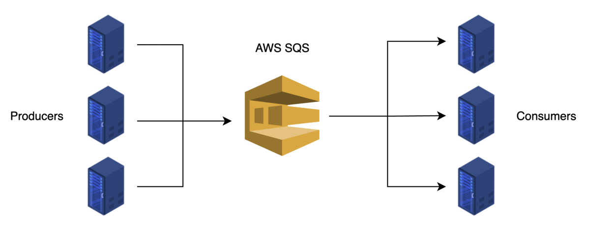

--> [AWS](/00-Intro/AWS.md)  -  [Development, Messaging, and Deployment](/05-Development-Messaging-Deploying/Development-Messaging-and-Deployment.md)
# Amazon Simple Queue Service (SQS)

**Amazon SQS** è un servizio di messaggistica completamente gestito che consente di **decouplare** (disaccoppiare) i componenti delle applicazioni distribuendo messaggi in modo asincrono tramite code.
SQS è **pull-based** e non push-based.



---

## 🧩 Caratteristiche principali

- **Completamente gestito**: nessuna infrastruttura da amministrare.
- **Scalabile**: gestisce milioni di messaggi al secondo.
- **Due tipi di code**:
  - **Standard Queue**: alta disponibilità, ordine non garantito, delivery at-least-once.
  - **FIFO Queue**: ordine garantito, delivery exactly-once.
- **Alta durabilità**: replica automatica su più zone.
- **Supporta DLQ (Dead Letter Queues)** per messaggi falliti.

---

## 📦 Quando usare SQS

- Per disaccoppiare servizi (es. tra frontend e backend).
- Per buffering e gestione del carico.
- Per integrazione tra microservizi.
- Per elaborazioni asincrone e retry automatici.

SQS può essere utilizzato per [disaccoppiare i componenti di un'applicazione](/05-Development-Messaging-Deploying/Decoupling-dei-componenti-applicativi.md). Disaccoppiare significa eliminare le dipendenze tra i componenti, in modo che i diversi elementi dell'applicazione possano operare in modo indipendente. Scambiando messaggi tramite SQS, i componenti non dipendono l’uno dall’altro e non si aspettano una risposta immediata. Rimuovere le dipendenze tra i componenti dell'applicazione consente a diverse parti dell'applicazione di guastarsi senza compromettere l'intera applicazione.

---

## 🔄 Come funziona

1. Il **Producer** invia un messaggio nella coda.
2. Uno o più **Consumer** leggono ed elaborano i messaggi.
3. Una volta elaborato, il messaggio viene **eliminato dalla coda**.

```plaintext
Producer ──▶ [ SQS Queue ] ──▶ Consumer
```

NB: Se il consumer crasha, il messaggio rimane nella coda e può essere letto dopo.

---

## 🎯 Code Standard vs FIFO in Amazon SQS

Amazon SQS offre **due tipi di code**: **Standard** e **FIFO (First-In-First-Out)**, ognuna ottimizzata per casi d’uso diversi.

### 🔁 Standard Queue

Le **code Standard** offrono:
- **Massima throughput** (milioni di messaggi al secondo)
- **Ordering best-effort**: l’ordine dei messaggi non è garantito, anche se generalmente i messaggi sono consegnati nell'ordine in cui sono spediti, con alcuni casi in cui l'ordine non è rispettato.
- **Delivery at-least-once**: un messaggio può essere consegnato più di una volta in caso di retry

✅ **Use case tipici**:
- Processi altamente scalabili dove l’ordine non è critico (es. elaborazione di immagini, invio email di massa, notifiche)
- Sistemi dove la duplicazione dei messaggi è tollerabile o gestita a livello applicativo

### 🧮 FIFO Queue

Le **code FIFO** offrono:
- **Ordinamento rigoroso**: i messaggi vengono consegnati **nell’esatto ordine** in cui sono stati inviati
- **Delivery exactly-once**: nessuna duplicazione
- **Throughput limitato**: fino a 300 msg/s con deduplica, o 3.000 msg/s con batching

✅ **Use case tipici**:
- Processi finanziari o di transazione dove l’ordine è fondamentale (es. gestione ordini, movimenti bancari)
- Workflow sequenziali (es. elaborazione step-by-step)
- Integrazione con sistemi legacy che non supportano duplicati

> 💡 *Scegli Standard se ti serve scalabilità estrema e tolleri ordine non garantito; scegli FIFO se la precisione nell’ordine e nell’unicità dei messaggi è un requisito.*

---

## 🕒 Short Polling vs Long Polling in Amazon SQS

Amazon SQS consente ai consumer di **recuperare i messaggi** da una coda utilizzando due modalità: **Short Polling** e **Long Polling**.

### ⚡ Short Polling

Con lo **short polling**, quando il consumer interroga la coda (`ReceiveMessage`), SQS **restituisce immediatamente** una risposta, anche se **nessun messaggio è disponibile**. Verifica solo un sottoinsieme dei nodi della coda, quindi non garantisce che tutti i messaggi presenti vengano restituiti.

- **Tempo di attesa: 0 secondi**
- **Bassa latenza**, ma può produrre molte chiamate vuote
- **Potenzialmente costoso** in caso di interrogazioni frequenti

✅ *Use case*: applicazioni che richiedono risposte rapide o che possono tollerare interrogazioni inefficaci

### ⏳ Long Polling

Con il **long polling**, il consumer può specificare un `WaitTimeSeconds` fino a **20 secondi**. In questo caso, SQS **attende che un messaggio sia disponibile**, riducendo le chiamate vuote e migliorando l’efficienza.

- **Riduce il costo** di interrogazione continua
- **Maggiore probabilità di ricevere un messaggio** alla prima chiamata
- **Minore latenza percepita** quando usato con un batch di messaggi

✅ *Use case*: applicazioni asincrone, sistemi a basso consumo, code FIFO o Standard dove l’efficienza è importante

> 🔄 *Usa il long polling come opzione predefinita* per **ridurre i costi**, evitare chiamate vuote e migliorare la reattività. Il short polling è adatto solo in casi specifici in cui l'applicazione ha bisogno di risposte immediate o con limiti tecnici particolari.

> NB: Il pricing è per risposta, quindi tante risposte vuote hanno un costo! Per risparmiare soldi, meglio il long polling.

---

## 🛠️ Comandi AWS CLI

```bash
# Crea una coda standard
aws sqs create-queue --queue-name mia-coda-standard

# Crea una coda FIFO
aws sqs create-queue --queue-name mia-coda.fifo \
  --attributes FifoQueue=true,ContentBasedDeduplication=true

# Invia un messaggio
aws sqs send-message \
  --queue-url https://sqs.region.amazonaws.com/account-id/mia-coda \
  --message-body "Messaggio di test"

# Ricevi un messaggio
aws sqs receive-message \
  --queue-url https://sqs.region.amazonaws.com/account-id/mia-coda

# Elimina un messaggio
aws sqs delete-message \
  --queue-url https://sqs.region.amazonaws.com/account-id/mia-coda \
  --receipt-handle <receipt-handle>
```

---

## 🔐 Sicurezza

- Controllo accessi con [IAM](/09-Sicurezza-Compliance-Governance/Sicurezza/AWS-IAM.md) Policies
- Crittografia **at-rest** con [AWS KMS](/09-Sicurezza-Compliance-Governance/Sicurezza/AWS-KMS.md)
- **Accesso cross-account** tramite policy specifiche
- Supporto per **VPC endpoint**

---

## ⚙️ Opzioni avanzate

- **Delay Queue**: ritardo configurabile per la visibilità dei messaggi.
- **Visibility Timeout**: tempo in cui un messaggio è invisibile dopo essere stato letto.
- **Message Timer**: delay su singolo messaggio.
- **Dead Letter Queue**: messaggi non elaborabili vengono spostati qui per debug.

---

## 🔄 SQS + SNS (Fan-out)

È possibile combinare **[Amazon SNS](/05-Development-Messaging-Deploying/Amazon-SNS.md) + SQS** per inviare lo stesso messaggio a più code SQS (fan-out pattern):

```plaintext
Publisher ─▶ SNS ─▶ SQS (Consumer A)
                  └▶ SQS (Consumer B)
```

---

## 🔁 SQS vs SNS vs EventBridge

| Caratteristica   | SQS                          | SNS                         | EventBridge                    |
|------------------|------------------------------|-----------------------------|--------------------------------|
| Tipo             | Queue (pull)                 | Pub/Sub (push)              | Event bus (router)            |
| Order            | FIFO opzionale               | No                          | No                             |
| Persistence      | Sì                           | No                          | No (ma integrabile con SQS)   |
| Target supportati| Uno per consumer             | Fan-out multiplo            | [AWS Lambda](/01-Compute-options/AWS-Lambda.md), [Amazon SQS](/05-Development-Messaging-Deploying/Amazon-SQS.md), [AWS Step Functions](/05-Development-Messaging-Deploying/AWS-Step-Functions.md), ecc.    |

---

## ✅ Best Practices

- Usa FIFO per ordine garantito.
- Configura DLQ per gestire errori.
- Ottimizza il Visibility Timeout in base ai tempi di elaborazione.
- Monitora la coda con [Amazon CloudWatch](/08-Auditing-Monitoring-Logging/Amazon-CloudWatch.md) (numero messaggi, tempi, errori).
- Usa più consumer per migliorare la scalabilità orizzontale.

---

## 📌 Conclusioni

Amazon SQS è uno strumento fondamentale per creare **architetture resilienti e scalabili**. Disaccoppia i componenti dell'applicazione, migliora la tolleranza ai guasti e consente elaborazioni asincrone affidabili.

> "SQS non solo collega servizi, li protegge dai loro punti deboli."
