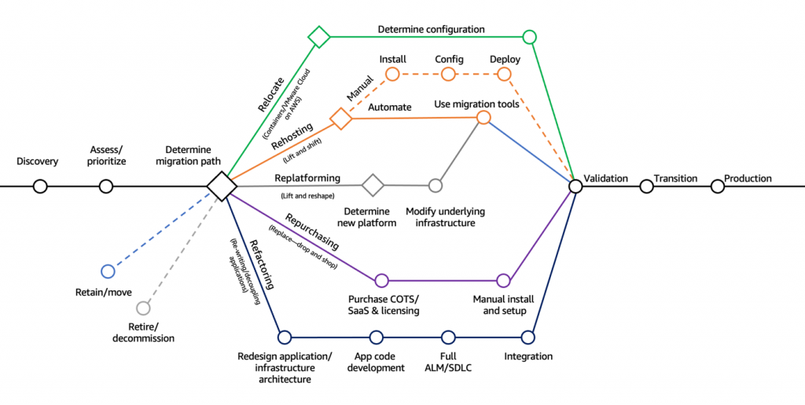

--> [AWS](/00-Intro/AWS.md)
# MigrationStrategies ad AWS

## 📦 Cosa sono le strategie di migrazione?

Nel contesto dell’adozione del cloud, [AWS](/00-Intro/AWS.md) ha identificato **sette strategie** comuni che le aziende possono seguire per migrare applicazioni e carichi di lavoro verso il cloud. Queste strategie, note come le **“7 R”**, aiutano a pianificare e implementare la migrazione in base a requisiti tecnici, costi, e obiettivi di business.  
Una versione semplificata delle "7 R" è quella delle "3 R", che comprende solo **Rehost**, **Replatform**, **Refactor**.

---

## 🔁 Le 7 Strategie di Migrazione (“7 R”)

### 1. ***Rehost (Lift and Shift)***  
Spostare l'applicazione così com'è nel cloud, senza modifiche al codice. È il metodo più veloce.  
**✅ Vantaggi:** Rapido, basso rischio.  
**❗Quando usarlo:** Sistemi legacy stabili, migrazione veloce.  

---

### 2. ***Replatform (Lift, Tinker, and Shift)***  
Spostare l'applicazione con alcune ottimizzazioni, ad esempio sostituendo il database con un servizio gestito ([Amazon-RDS](/04-Database-services/Amazon-RDS.md)).  
**✅ Vantaggi:** Bilancia rapidità e miglioramento tecnico.  
**❗Quando usarlo:** Quando si vogliono piccoli benefici cloud senza riscrivere tutto.

---

### 3. Repurchase (Drop and Shop)  
Sostituire l'applicazione esistente con una SaaS (Software as a Service), come Salesforce o Workday.  
**✅ Vantaggi:** Nessuna gestione dell’infrastruttura.  
**❗Quando usarlo:** Se un'alternativa SaaS soddisfa i requisiti aziendali.

---

### 4. ***Refactor / Re-architect***  
Ripensare e riscrivere l’applicazione per sfruttare pienamente le funzionalità cloud-native (es. microservizi, [AWS-Lambda](/01-Compute-options/AWS-Lambda.md), [Amazon-DynamoDB](/04-Database-services/Amazon-DynamoDB.md)).  
**✅ Vantaggi:** Scalabilità, resilienza, costi ottimizzati.  
**❗Quando usarlo:** Per app strategiche o in difficoltà tecnica.

---

### 5. Retire  
Disattivare le applicazioni che non sono più necessarie o utilizzate.  
**✅ Vantaggi:** Riduce i costi e la complessità.  
**❗Quando usarlo:** Dopo un assessment del portafoglio applicativo.

---

### 6. Retain  
Mantenere l'applicazione on-premise per il momento, per motivi tecnici, normativi o strategici.  
**✅ Vantaggi:** Flessibilità, riduzione del rischio.  
**❗Quando usarlo:** Se non è ancora il momento giusto per migrare.

---

### 7. Relocate  
Spostare infrastrutture virtualizzate (es. VMware) nel cloud senza modifiche, mantenendo lo stesso ambiente.  
**✅ Vantaggi:** Nessuna modifica all’architettura, migrazione veloce.  
**❗Quando usarlo:** Per ambienti virtuali consolidati.

---

## 🛠️ Scelta della strategia giusta

Ogni strategia ha vantaggi, costi e rischi diversi. Una valutazione iniziale del **portafoglio applicativo**, delle **dipendenze tecniche** e degli **obiettivi di business** è fondamentale per scegliere il giusto approccio.  
Si devono considerare:
- La complessità dell'applicazione  
- Gli obbiettivi di business da raggiungere  
- Il budget e le risorse a disposizione  
- La compliance e il rischio dell'operazione

---

## ✅ Quindi...

Comprendere e applicare correttamente le strategie di migrazione [AWS](/00-Intro/AWS.md) permette alle aziende di modernizzare i propri sistemi in modo efficace, sicuro e sostenibile, sfruttando al massimo i vantaggi del cloud.

---

## 🛠️ Strumenti AWS per la Migrazione

[AWS](/00-Intro/AWS.md) mette a disposizione un insieme completo di strumenti per supportare le aziende in tutte le fasi della migrazione al cloud: dalla valutazione iniziale, alla migrazione vera e propria, fino al monitoraggio e all’ottimizzazione post-migrazione. Di seguito una panoramica dei principali:

### 🔍 Valutazione e Pianificazione

- **AWS Migration Evaluator**: fornisce un'analisi dell'infrastruttura IT esistente e una stima dei costi nel cloud.
- **[AWS Application Discovery Service](/06-Cloud-Adoption-Framework-and-Migration-Strategies/AWS-Application-Discovery-Service.md)**: raccoglie informazioni sulle applicazioni, sulle dipendenze e sull’utilizzo delle risorse.
- **AWS Cloud Adoption Readiness Tool (CART)**: strumento di autovalutazione dell'organizzazione.
- **[AWS Trusted Advisor](/08-Auditing-Monitoring-Logging/AWS-Trusted-Advisor.md)**: fornisce raccomandazioni su sicurezza, performance, limiti e costi.

### 🚚 Esecuzione della Migrazione

- **[AWS Application Migration Service](/06-Cloud-Adoption-Framework-and-Migration-Strategies/AWS-Application-Migration-Service.md)** (MGN): per la migrazione automatizzata di server fisici e virtuali.
- **[AWS Database Migration Service](/06-Cloud-Adoption-Framework-and-Migration-Strategies/AWS-Database-Migration-Service.md)** (DMS): per la migrazione di database, anche eterogenea.
- **[AWS Schema Conversion Tool](/06-Cloud-Adoption-Framework-and-Migration-Strategies/AWS-Schema-Conversion-Tool.md)** (SCT): converte gli schemi di database tra motori differenti.

### 📦 Trasferimento Dati

- **AWS DataSync**: trasferimento automatizzato tra on-premise e cloud ([Amazon-EFS](/02-Storage-services/Amazon-EFS.md), [FSx](/02-Storage-services/Amazon-FSx.md), ecc.).
- **[AWS Snow Family](/06-Cloud-Adoption-Framework-and-Migration-Strategies/AWS-Snow.md)**: dispositivi fisici per grandi volumi: [AWS Snowcone](/06-Cloud-Adoption-Framework-and-Migration-Strategies/AWS-Snowcone.md), [AWS Snowball](/06-Cloud-Adoption-Framework-and-Migration-Strategies/AWS-Snowball-Edge.md), [AWS Snowmobile](/06-Cloud-Adoption-Framework-and-Migration-Strategies/AWS-Snowmobile.md).
- **[AWS Transfer Family](/06-Cloud-Adoption-Framework-and-Migration-Strategies/AWS-Transfer-Family.md)**: trasferimenti gestiti via SFTP, FTPS, FTP verso [Amazon-S3](/02-Storage-services/Amazon-S3.md).

### 📊 Monitoraggio e Gestione

- **[AWS Migration Hub](/06-Cloud-Adoption-Framework-and-Migration-Strategies/AWS-Migration-Hub.md)**: tracciamento centralizzato della migrazione.
- **AWS Migration Hub Orchestrator**: automatizza e coordina le attività di migrazione.
- **CloudEndure Migration**: replica continua dei server per ridurre il downtime.

---

Questi strumenti lavorano in sinergia per garantire una migrazione efficiente, sicura e su misura rispetto ai requisiti dell’organizzazione.

Le migration strategies devono essere impiegate seguendo il [Cloud Adoption Framework](/06-Cloud-Adoption-Framework-and-Migration-Strategies/Cloud-Adoption-Framework.md).