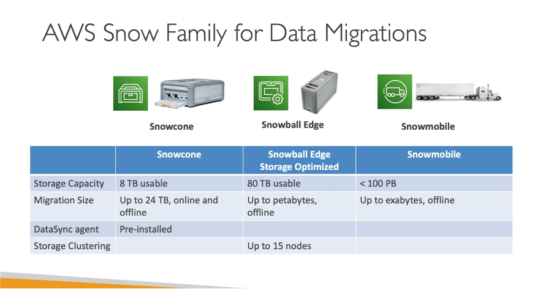

--> [AWS](/00-Intro/AWS.md)  -  [Migration Strategies](/06-Cloud-Adoption-Framework-and-Migration-Strategies/AWS-Migration-Strategies.md)
# ❄️ AWS Snow Family

## 📘 Cos'è e come funziona

La **AWS Snow Family** è un insieme di dispositivi fisici progettati per **trasferire grandi volumi di dati** tra ambienti on-premises e AWS in modo sicuro ed efficiente, soprattutto in scenari in cui la **connessione Internet è limitata, costosa o inesistente**.

Include tre soluzioni principali:
- **AWS Snowcone**: dispositivo ultra-portatile, fino a 8 TB
- **AWS Snowball**: versione rugged, da 50 a 80 TB
- **AWS Snowmobile**: camion containerizzato per trasferire fino a 100 PB

I dispositivi vengono ordinati da AWS, spediti al cliente, caricati con i dati, e restituiti ad AWS dove vengono trasferiti nel cloud in modo sicuro e verificato.

---

## ✨ Caratteristiche principali e vantaggi

- 📦 **Trasferimento fisico dei dati**: evita limiti di banda e tempi lunghi via Internet
- 🔐 **Crittografia end-to-end**: dati cifrati a 256-bit con gestione chiavi tramite AWS KMS
- 💻 **Elaborazione locale (edge computing)**: possibilità di eseguire AWS IoT Greengrass, EC2 e Lambda direttamente sul dispositivo
- 🚚 **Resistente e trasportabile**: dispositivi robusti per ambienti industriali o remoti
- ⚡ **Rilevamento automatico e spedizione tracciabile**

---

## 🚀 Use case comuni

- Migrazione iniziale di grandi dataset nel cloud AWS
- Backup offline in ambienti isolati o con connettività instabile
- Raccolta ed elaborazione dati in campo (es. militare, petrolifero, navale)
- Disaster recovery e archiviazione sicura
- Edge computing in ambienti remoti

---

## 💰 Pricing

- **AWS Snowcone**: si paga per il noleggio giornaliero + spedizione
- **AWS Snowball**: costo fisso per job, include trasporto e 10 giorni di utilizzo
- **AWS Snowmobile**: pricing personalizzato, su richiesta diretta ad AWS
- In tutti i casi, l’**importazione dei dati in AWS è gratuita**. I costi possono includere anche la restituzione del dispositivo e eventuali servizi aggiuntivi.

---

## 🔄 Confronto con servizi simili

| Servizio            | Metodo di trasferimento | Capacità         | Edge computing | Caso d’uso ideale                      |
|---------------------|-------------------------|------------------|----------------|----------------------------------------|
| **[AWS Snowcone](/06-Cloud-Adoption-Framework-and-Migration-Strategies/AWS-Snowcone.md)**    | Fisico                  | Fino a 8 TB      | ✅              | Remoto, portatile, piccole sedi        |
| **[AWS Snowball Edge](/06-Cloud-Adoption-Framework-and-Migration-Strategies/AWS-Snowball-Edge.md)**    | Fisico                  | 50–80 TB         | ✅              | Migrazioni e backup a media scala      |
| **[AWS Snowmobile](/06-Cloud-Adoption-Framework-and-Migration-Strategies/AWS-Snowmobile.md)**  | Fisico (container)      | Fino a 100 PB    | ❌              | Data center intero, migrazioni massive |
| **AWS DataSync**    | Rete                    | Illimitata       | ❌              | Dati in movimento via rete (online)    |

---

## 📌 Conclusione

La **Snow Family** è essenziale per le organizzazioni che devono trasferire grandi quantità di dati in AWS in modo **sicuro, affidabile e offline**, o che operano in ambienti con **connettività limitata**. I dispositivi offrono anche funzionalità di **edge computing**, permettendo l'elaborazione dei dati prima ancora che arrivino nel cloud.

> “Quando la rete non basta, Snow Family è la via più rapida e sicura verso AWS.”

