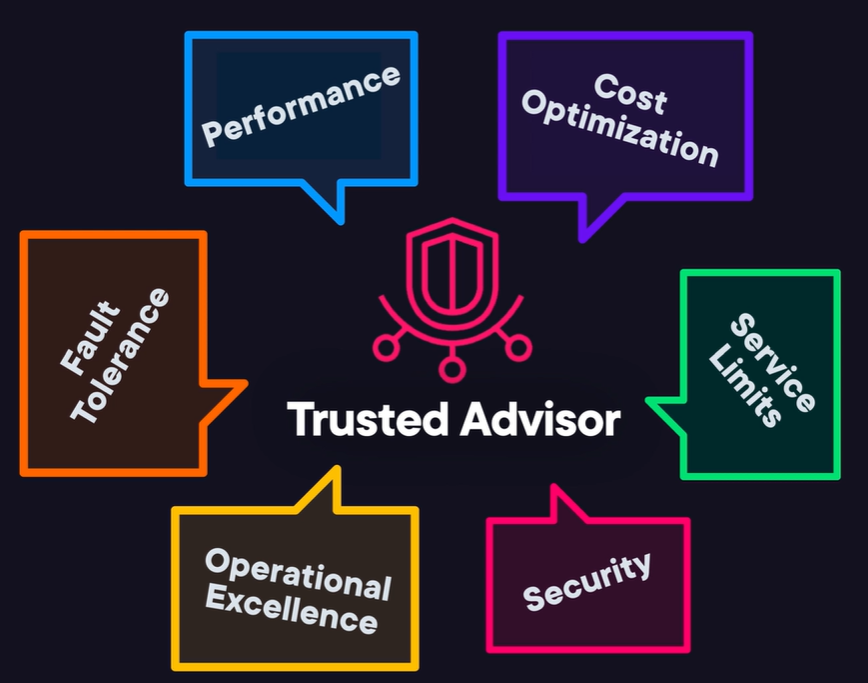
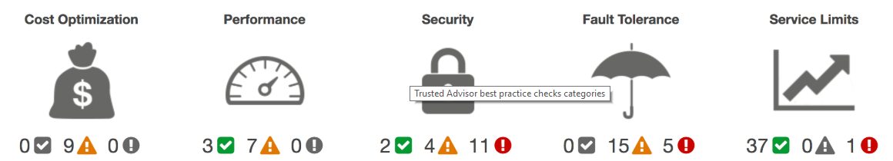

--> [AWS](/00-Intro/AWS.md)  -  [Auditing, Monitoring, Logging](/08-Auditing-Monitoring-Logging/Auditing-Monitoring-Logging.md)
# AWS Trusted Advisor

## 🛡️ Cos'è AWS Trusted Advisor?

AWS Trusted Advisor è un servizio che fornisce **raccomandazioni personalizzate** per aiutarti a ottimizzare il tuo ambiente AWS. Copre aspetti come **sicurezza, performance, costi**, limiti di servizio e fault tolerance.

Lavora a livello di account AWS e contiene consigli sulle best practices da attuare e esegue dei controlli in automatico per controllare che siano attuate.

Per ricevere notifiche da Trusted Advisor, il customer può attivare il servizio di **Trusted Advisor Notification**, attivando le sue notifiche nella Dashboard.

Un'altra funzione di Trusted Advosor è di controllare l'utilizzo dei servizi per tutte le risorse. La funzionalità **Service Limits** di AWS Trusted Advisor controlla se l'utilizzo dei servizi AWS si sta avvicinando ai limiti impostati per ciascuna risorsa (come istanze EC2, volumi EBS, bucket S3, ecc.), aiutando a prevenire interruzioni o errori dovuti al superamento delle quote.

---

## 🔍 Benefici di AWS Trusted Advisor

AWS Trusted Advisor offre una panoramica completa per ottimizzare e proteggere l’ambiente AWS, suddividendo le sue funzionalità in cinque macro‑aree o ambiti di controllo:

- **Ottimizzazione dei costi** – Analizza l’utilizzo, la configurazione e la spesa, individuando risorse inutilizzate o sottoutilizzate e fornendo raccomandazioni pratiche per ottimizzare la spesa cloud.  
- **Performance** – Suggerisce interventi basati su best practice per migliorare le performance dei servizi.  
- **Sicurezza** – Indica le principali best practice di sicurezza per coprire vulnerabilità critiche e migliorare la protezione dell’infrastruttura. Controlla prottivamente le configurazioni rischiose e suggerisce correzioni nell'ambiente AWS.
- **Fault tolerance/Resilienza** – Propone misure per aumentare l’affidabilità e la continuità operativa dei servizi anche in caso di guasti.  
- **Limiti di servizio (service quotas)** – Monitora e segnala quando ci si avvicina ai limiti di risorse (quota massima) per evitare interruzioni dovute al superamento dei limiti.  

---

## 🧾 Piani di accesso

- **Basic (gratuito)**: include 7 controlli di base.
- **Business e Enterprise**: accesso completo a oltre 100 controlli e a Trusted Advisor Priority.

---

## 🎯 Quando usarlo

- Prima, durante e dopo una migrazione ad AWS
- Per migliorare la governance e la gestione dei costi
- Come parte della strategia di **ottimizzazione continua**

