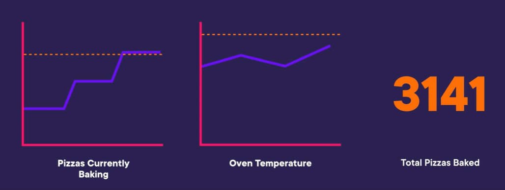

--> [AWS](/00-Intro/AWS.md)  -  [Auditing, Monitoring, Logging](/08-Auditing-Monitoring-Logging/Auditing-Monitoring-Logging.md)
# Amazon CloudWatch

**Amazon CloudWatch** è un servizio di monitoraggio completamente gestito che fornisce **visibilità operativa in tempo reale** su risorse AWS, applicazioni e infrastrutture. 
Raccoglie e traccia **metriche**, **log**, **eventi** e **traces**, aiutando a individuare problemi e ottimizzare le performance.
Si possono creare dashboards a partire da queste metriche definite per monitorare cosa sta succedendo nei servizi AWS monitoriati. 
Le metriche monitorate possono portare alla creazione di allarmi.



---

## 🧩 Caratteristiche principali

- **Monitoraggio delle risorse AWS** (EC2, RDS, Lambda, ECS, API Gateway, ecc.)
- **Raccolta log** da applicazioni, sistemi operativi e container
- **Dashboard personalizzabili**
- **Allarmi automatici** su soglie di metriche
- **Eventi reattivi** con integrazione a EventBridge
- **Tracing distribuito** tramite AWS X-Ray
- **Monitoraggio on-premise** tramite agenti

---

## 📊 Tipi di dati monitorabili

### 📈 Metriche

- Dati numerici raccolti a intervalli regolari (es. utilizzo CPU, memoria, richieste HTTP)
- Visibili per default o pubblicabili via API o SDK
- Aggregabili (media, max, min, percentile)

### 📄 Log

- File di log applicativi, di sistema, Lambda, container, ecc.
- Analizzabili con Amazon CloudWatch Logs Insights (query SQL-like)
- **NB:** Hanno un periodo di retention, e la retention ha un costo!

### 🚨 Allarmi

- Allarmi su metriche o risultati di query log
- Azioni automatiche: SNS, Lambda, Auto Scaling, ecc.

### 📍 Eventi

- Eventi operativi (es. EC2 avviata, Lambda fallita)
- Integrazione diretta con **Amazon EventBridge**

---

## 🛠️ Esempi di utilizzo

- Creare un allarme se l'utilizzo CPU supera l'80% per 5 minuti
- Trovare errori in log Lambda usando query come:
  ```sql
  fields @timestamp, @message
  | filter @message like /ERROR/
  | sort @timestamp desc
  | limit 20
  ```

- Mostrare una dashboard con metriche EC2, RDS, e Application Load Balancer
- Inviare notifiche via SNS in caso di eventi critici
- Gli **allarmi di CloudWatch** possono essere utilizzati per inviare notifiche o attivare eventi automatici quando le metriche raggiungono soglie predefinite.

---

## 🔧 Amazon CloudWatch Agent

Per raccogliere metriche personalizzate e log da EC2 o server on-premise, serve installare sull'istanza un CloudWatch Agent:
- Installa l’**agent CloudWatch**
- Configura un file `amazon-cloudwatch-agent.json`
- Avvia l’agente per inviare dati

---

## 📦 Integrazioni principali

- **Lambda**: log e metriche automatiche
- **ECS/EKS**: metrica di container + log applicativi
- **Auto Scaling**: trigger su metriche CloudWatch
- **EventBridge**: eventi operativi per reagire a modifiche di stato
- **X-Ray**: tracing distribuito e monitoraggio delle prestazioni

---

## ✅ Best Practices

- Centralizza la raccolta log su un unico gruppo
- Usa tag coerenti per facilitare filtri e dashboard
- Configura allarmi con **percentili** per evitare falsi positivi
- Imposta retention per i log in base ai requisiti aziendali
- Monitora trend a lungo termine per ottimizzazione costi e performance

---
### CloudWatch Logs

Amazon CloudWatch Logs è un componente di CloudWatch dedicato alla raccolta, monitoraggio e analisi dei log generati da risorse AWS e applicazioni personalizzate. 

Consente di acquisire log da istanze EC2 (tramite l’agent CloudWatch), [AWS Lambda](/01-Compute-options/AWS-Lambda.md), Amazon API Gateway, container in esecuzione su [Amazon ECS](/01-Compute-options/Amazon-ECS.md) o [AWS Fargate](/01-Compute-options/AWS-Fargate.md), e molte altre sorgenti. 
I log possono essere cercati, filtrati, archiviati a lungo termine e utilizzati per generare metriche personalizzate. 

CloudWatch Logs permette inoltre di impostare trigger per attivare azioni automatiche basate su pattern specifici nei log, facilitando il rilevamento di errori, anomalie o eventi rilevanti in tempo reale.

Se si vogliono utilizzare i logs di applicazioni già esistenti senza modificarne il codice (per esempio, modificare il codice per adattare i logs a uno stream di dati), e generare metriche, analytics e alerts, CloudWatch Logs è la scelta giusta.

---

## 📌 Conclusioni

Amazon CloudWatch è il centro di osservabilità in AWS. Rende possibile **monitorare, analizzare e reagire** a ciò che accade nelle applicazioni e infrastrutture cloud. È uno strumento essenziale per DevOps, ingegneri SRE e team di sicurezza.

> “Non puoi migliorare ciò che non puoi osservare — CloudWatch ti dà gli occhi nel cloud.”
