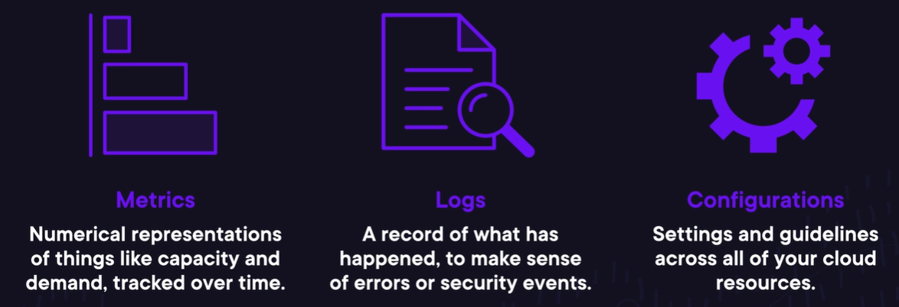
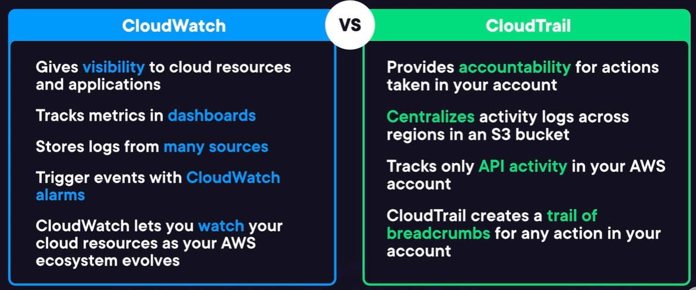

--> [AWS](/00-Intro/AWS.md)
# 🔍 AWS per Auditing, Monitoring e Logging

## 📘 Introduzione

Nel cloud computing, è fondamentale **monitorare l'infrastruttura**, **registrare le attività** e **verificare la conformità** dei sistemi per garantire sicurezza, prestazioni ottimali e tracciabilità. [AWS](/00-Intro/AWS.md) offre un'ampia gamma di servizi progettati per supportare:

- **Monitoring**: osservare lo stato, le prestazioni e la disponibilità delle risorse in tempo reale.
- **Logging**: registrare eventi, errori, richieste e attività interne ai servizi.
- **Auditing**: tracciare chi ha fatto cosa, quando e da dove, per scopi di sicurezza, governance e compliance.

Questi strumenti sono fondamentali per:
- Identificare problemi di performance
- Rilevare attività sospette
- Auditare modifiche a risorse
- Rispettare standard normativi (es. GDPR, HIPAA, ISO)

Tre sono le cose principali da monitorare:
- **Metriche**: possono essere pubblicate dai servizi AWS stessi, e aiutano a monitorare lo stato di salute e i workload degli stessi. Il loro monitoraggio può portare a attivare azioni di risposta al loro valore o cambiamento.
- **Logs**: sono prodotti da quasi tutte le risorse AWS, e da loro sono estrapolate le metriche. Inoltre, tracciano tutte le azioni che avvengono nell'account AWS.
- **Configurazioni**: Sono un set di impostanzioni e standard per le risorse, che possono essere standardizzate, analizzate per le best practices e riutilizzate.

Se le risorse da monitorare sono molte, ci sono degli strumenti da utilizzare per gestire questa complessità: [Tag e AWS Systems Manager](/08-Auditing-Monitoring-Logging/Tag-e-AWS-Systems-Manager.md)

---

## 📊 Metriche e log nel Well-Architected Framework di AWS

Nel contesto del **Well-Architected Framework di AWS**, l’uso corretto di **metriche e log** è fondamentale per supportare tutti e sei i pilastri architetturali:

- 🔐 **Sicurezza**: il tracciamento delle azioni sulle risorse consente di rilevare accessi non autorizzati e anomalie, rendendo il logging uno strumento essenziale per la sicurezza.
- 💸 **Ottimizzazione dei costi**: analizzare l’utilizzo effettivo delle risorse tramite metriche permette di evitare sprechi e ottimizzare i costi operativi.
- ⚡ **Efficienza delle prestazioni**: le metriche aiutano a garantire che i workload siano veloci, reattivi e adattivi alle variazioni di carico.
- ⚙️ **Eccellenza operativa**: il logging accurato delle configurazioni e delle attività consente una migliore gestione del ciclo di vita, delle modifiche e della risoluzione dei problemi.
- 🟣 **Affidabilità**: la visibilità sullo stato e l’uptime delle risorse è essenziale per mantenere la continuità operativa e gestire correttamente i failover.
- 🌱 **Sostenibilità**: le metriche possono essere utilizzate per monitorare l’impronta di carbonio delle risorse, contribuendo a costruire sistemi più sostenibili dal punto di vista ambientale.

> In sintesi, log e metriche non sono solo strumenti tecnici, ma **alleati strategici per costruire sistemi cloud robusti, sicuri, efficienti e sostenibili.**

---

## 🧰 Servizi AWS principali per auditing, monitoring e logging

### ☁️ [Amazon CloudWatch](/08-Auditing-Monitoring-Logging/Amazon-CloudWatch.md)

- **Monitoraggio in tempo reale** di metriche, log e allarmi.
- Visualizzazione tramite dashboard.
- Supporto per log custom e log di sistema (es. EC2, Lambda).
- Integrazione con EventBridge per automazione.

### 🧾 [AWS CloudTrail](/08-Auditing-Monitoring-Logging/Amazon-CloudTrail.md)

- **Auditing di tutte le API call e attività [IAM](/09-Sicurezza-Compliance-Governance/Sicurezza/AWS-IAM.md)**.
- Traccia chi ha eseguito quale azione, da quale IP, in quale momento.
- Archiviazione sicura dei log su S3.
- Utile per sicurezza, audit e investigazione di incidenti.

### 📊 [AWS Config](/08-Auditing-Monitoring-Logging/AWS-Config.md)

- Monitoraggio delle **configurazioni delle risorse AWS**, delle relazioni tra loro e delle loro variazioni nel tempo.
- **Valutazione della conformità** rispetto a regole personalizzate o standard (es. CIS).
- Storico delle configurazioni per troubleshooting e audit.

### 🛡️ AWS CloudTrail Lake

- Analisi e interrogazione dei log di CloudTrail tramite SQL.
- Ideale per audit avanzati e investigazioni interattive.

### 🧠 [Amazon Detective](/09-Sicurezza-Compliance-Governance/Sicurezza/Amazon-Detective.md)

- Analisi e correlazione automatica degli eventi di sicurezza.
- Aiuta a investigare attività sospette su CloudTrail, VPC Flow Logs, GuardDuty.

### 🔐 [AWS Security Hub](/09-Sicurezza-Compliance-Governance/Sicurezza/AWS-Security-Hub.md)

- Raccolta e correlazione di **eventi di sicurezza** da vari servizi AWS.
- Fornisce un **punteggio di sicurezza** e report di conformità automatizzati.

### 🧪 [AWS Audit Manager](/08-Auditing-Monitoring-Logging/AWS-Audit-Manager.md)

- Aiuta a **preparare audit di conformità** (es. GDPR, SOC2, HIPAA).
- Raccoglie automaticamente evidenze da CloudTrail, Config, ecc.
- Organizza le evidenze in pacchetti auditabili.

---
## 🆚 Confronto: Amazon CloudWatch vs AWS CloudTrail

**[Amazon CloudWatch](/08-Auditing-Monitoring-Logging/Amazon-CloudWatch.md)** e **[AWS CloudTrail](/08-Auditing-Monitoring-Logging/Amazon-CloudTrail.md)** sono due servizi fondamentali per la visibilità e il monitoraggio in AWS, ma svolgono ruoli diversi e complementari.

- [Amazon CloudWatch](/08-Auditing-Monitoring-Logging/Amazon-CloudWatch.md) è progettato per il **monitoraggio delle prestazioni e dello stato operativo** delle risorse AWS (e on-premises). Raccoglie **metriche**, **log di applicazioni**, e può generare **allarmi** o **visualizzazioni** in tempo reale. È ideale per rispondere a domande come “quanta CPU sta usando la mia istanza EC2?” o “la mia Lambda ha avuto errori?”

- [AWS CloudTrail](/08-Auditing-Monitoring-Logging/Amazon-CloudTrail.md), invece, si concentra sul **monitoraggio della sicurezza e delle attività utente**. Registra tutte le chiamate API effettuate su un account AWS (da utenti, servizi o console), tracciando **chi ha fatto cosa, quando e da dove**. È essenziale per auditing, compliance e investigazioni di sicurezza.

In sintesi:
- **CloudWatch** → osserva il **comportamento delle risorse in esecuzione**
- **CloudTrail** → tiene traccia di **azioni e modifiche** a livello di API

> 💡 Usarli insieme permette di ottenere **visibilità completa**: CloudWatch per monitorare, CloudTrail per auditare.

---

## 📌 Altri servizi utili

| Servizio                                                  | Ruolo nella gestione                                                     |
| --------------------------------------------------------- | ------------------------------------------------------------------------ |
| **[AWS X-Ray](/08-Auditing-Monitoring-Logging/AWS-X-Ray.md)**                             | Tracciamento delle richieste nelle applicazioni distribuite (tracing)    |
| **Amazon VPC Flow Logs**                                  | Log del traffico di rete tra risorse in [VPC](/03-CDN-e-Networking/Amazon-VPC.md)                              |
| **Amazon S3 Access Logs**                                 | Tracciamento accessi a bucket S3                                         |
| **[AWS Trusted Advisor](/08-Auditing-Monitoring-Logging/AWS-Trusted-Advisor.md)**         | Fornisce raccomandazioni su sicurezza, performance, costi e conformità   |
| **AWS Shield / GuardDuty**                                | Protezione e rilevamento minacce, con logging degli attacchi             |
| [AWS Heath Dashboard](/08-Auditing-Monitoring-Logging/AWS-Heath-Dashboard.md)             | Monitoraggio real-time e risposta a cambio di stato di salute di risorse |
| [AWS Well-Architected Tool](/08-Auditing-Monitoring-Logging/AWS-Well-Architected-Tool.md) | Controllo di workloads, best practices, generazione di piani di azione   |

---
## 🔍 Auditing in AWS

L’**auditing** in AWS è il processo di **monitoraggio, registrazione e analisi delle attività** all’interno di un ambiente cloud, con l’obiettivo di garantire **sicurezza, conformità e governance**. 

Grazie a servizi come **[AWS CloudTrail](/08-Auditing-Monitoring-Logging/Amazon-CloudTrail.md)**, **[AWS Config](/08-Auditing-Monitoring-Logging/AWS-Config.md)** e **[AWS Audit Manager](/08-Auditing-Monitoring-Logging/AWS-Audit-Manager.md)**, è possibile tracciare **chi ha fatto cosa, quando e da dove**, ottenere lo storico delle modifiche a livello di configurazione e raccogliere automaticamente **evidenze di conformità** rispetto a standard come GDPR, ISO 27001, HIPAA o SOC 2. 

L’auditing è fondamentale per **individuare attività sospette**, **prevenire accessi non autorizzati** e supportare **investigazioni** in caso di incidenti di sicurezza o non conformità. 
Inoltre, combinando audit trail con strumenti come **CloudWatch Logs** o **Amazon Detective**, è possibile ottenere un controllo completo e proattivo dell’intero ciclo di vita delle risorse AWS.

---
## ✅ Conclusione

L’ecosistema AWS fornisce strumenti potenti per avere piena **visibilità operativa**, garantire **sicurezza e compliance**, e reagire rapidamente ad **anomalie** o **incidenti**. Usare insieme servizi come **CloudWatch, CloudTrail, Config** e **Security Hub** consente di costruire un'infrastruttura **trasparente, sicura e auditabile**.

> “Non puoi proteggere ciò che non puoi osservare. Con AWS, visibilità e controllo sono al centro della tua strategia cloud.”
