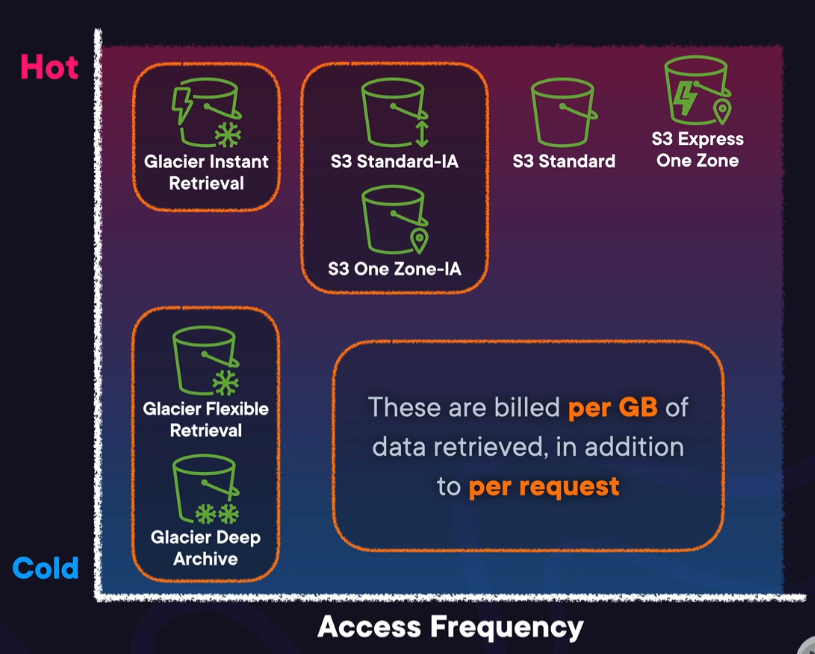
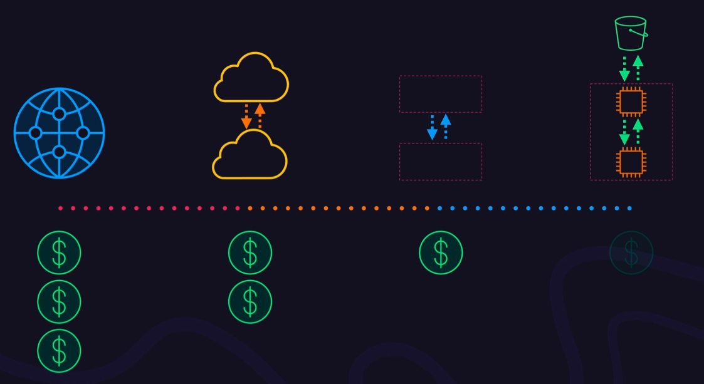

--> [AWS](/00-Intro/AWS.md)
# 💰 Prezzo, Fatturazione e Supporto in AWS

## 📘 Introduzione

[Amazon Web Services](/00-Intro/AWS.md) (AWS) adotta un modello di **prezzi basato sul consumo**, in cui paghi solo per quello che usi, senza costi anticipati o obblighi di lungo termine (in quasi tutti i servizi).

La **fatturazione** è centralizzata e personalizzabile, e può coprire ambienti multi-account tramite **[AWS Organizations](09-Sicurezza-Compliance-Governance/Compliance e Governance/AWS-Organizations.md)**.
AWS offre inoltre strumenti per **monitorare, ottimizzare e prevedere i costi**, oltre a diversi **piani di supporto tecnico** pensati per sviluppatori, aziende e clienti enterprise.

---

## 💸 Come funziona la fatturazione in AWS

- Il **modello di pricing è pay-as-you-go**, con opzioni per risparmio tramite, per esempio:
  - **Savings Plans**
  - **Reserved Instances**
  - **Free Tier** (uso gratuito con limiti)
- I **costi sono calcolati per secondo, minuto o ora** a seconda del servizio
- Ogni risorsa utilizzata (EC2, S3, Lambda, ecc.) contribuisce alla **fattura mensile**
- I costi possono essere **monitorati per servizio, account, tag, regione**

---

## 🧾 Supporto alla fatturazione e costi

### ✅ Opzioni di pagamento
- Carta di credito/debito
- Fattura per clienti enterprise

### 🧮 Cost Explorer e report
- Analisi dettagliata dei costi e trend
- Grafici per servizi, regioni, tag, account
- Previsioni di spesa basate sull’uso storico

### 📑 Consolidated Billing
- Attivabile tramite **AWS Organizations** (Che non lo comprende di default!)
- Consente di accorpare la fattura per tutti gli account del gruppo
- Applica automaticamente gli sconti su volume

---
## 💸 Total Cost of Ownership (TCO) in AWS

Il **Total Cost of Ownership (TCO)** rappresenta il **costo complessivo** associato alla gestione e al mantenimento di un’infrastruttura IT, considerando **non solo i costi diretti**, ma anche quelli **indiretti** e **operativi**. 

In AWS, il TCO include:
- 💰 **Costi diretti**: risorse computazionali ([EC2](/01-Compute-options/Amazon-EC2.md), [Lambda](/01-Compute-options/AWS-Lambda.md)), storage ([S3](/02-Storage-services/Amazon-S3.md), [EBS](/02-Storage-services/Amazon-EBS.md)), database ([RDS](/04-Database-services/Amazon-RDS.md), [DynamoDB](/04-Database-services/Amazon-DynamoDB.md)), networking ([VPC](/03-CDN-e-Networking/Amazon-VPC.md), Data Transfer).
- 🔧 **Costi operativi**: gestione dei server, patching, aggiornamenti, bilanciamento del carico, backup (Aspetti che, a seconda del servizio, potrebbero essere gestiti da AWS).
- 👥 **Costi di personale**: tempo e risorse umane necessarie per mantenere e monitorare l’infrastruttura.
- 🔐 **Costi di sicurezza e conformità**: strumenti per auditing, logging, controllo degli accessi ([CloudTrail](/08-Auditing-Monitoring-Logging/Amazon-CloudTrail.md), [Config](/08-Auditing-Monitoring-Logging/AWS-Config.md), [IAM](/09-Sicurezza-Compliance-Governance/Sicurezza/AWS-IAM.md)).
- ⚙️ **Costi di manutenzione e aggiornamento hardware**: eliminati o ridotti nel cloud grazie al modello managed di AWS.

AWS offre uno strumento chiamato **[TCO Calculator](/10-Prezzo-Fatturazione-Supporto/TCO-Calculator.md)** per confrontare i costi dell'infrastruttura on-premises con quelli di un'architettura equivalente su AWS, aiutando le aziende a prendere decisioni informate in ottica di ottimizzazione economica e strategica.

###  I sei vantaggi del cloud e il costo AWS

Ogni vantaggio del cloud computing ha un impatto diretto sul **Total Cost of Ownership (TCO)** e rende AWS più conveniente rispetto all’on-premise:
1. **Trade capital for variable expense** – On-premise richiede grandi investimenti iniziali in hardware, data center e licenze. Con AWS, paghi solo ciò che usi, trasformando la spesa in **costo operativo flessibile**, che scala con l’uso effettivo.
2. **Benefit from massive economies of scale** – AWS può offrire prezzi inferiori grazie a volumi elevatissimi. Acquistare risorse IT in autonomia è più costoso, mentre con AWS ottieni **tariffe più basse per compute, storage e rete**.
3. **Stop guessing capacity** – In ambienti on-premise, acquistare più del necessario porta a **sprechi**, mentre sottostimare la capacità crea **colli di bottiglia**. In AWS, **scali in base alla domanda**, evitando **overprovisioning costoso**.
4. **Increase speed and agility** – L’agilità nel cloud riduce i costi legati al **time-to-market** e agli **errori da provisioning manuale**. Ogni minuto risparmiato nel setup è **tempo (e denaro) risparmiato** nello sviluppo e nel rilascio.
5. **Stop spending money on running and maintaining data centers** – L’on-premise richiede **manodopera specializzata, energia, raffreddamento, sicurezza fisica**. In AWS, tutta questa infrastruttura è gestita per te, riducendo i **costi operativi nascosti**.
6. **Go global in minutes** – Espandere a livello internazionale con data center propri è estremamente costoso. Con AWS, puoi **lanciare risorse in altre regioni** senza investimenti locali, **contenendo i costi di espansione geografica**.

> In sintesi, i vantaggi del cloud riducono sia i **costi diretti** (hardware, licenze) che quelli **indiretti** (manodopera, inefficienze), rendendo AWS più economico, prevedibile e scalabile nel tempo rispetto all’infrastruttura on-premise.

---
## ⚙️ Come ottimizzare i costi dei servizi di compute in AWS

Ottimizzare i costi del compute su AWS significa utilizzare in modo intelligente le risorse per **evitare sprechi** e **massimizzare il valore per ogni dollaro speso**. 
Ecco le strategie principali:

- 🧠 **Right-sizing delle istanze EC2**: analizzare l'utilizzo effettivo di CPU, memoria e rete per scegliere la **giusta dimensione dell’istanza**, evitando overprovisioning. Lo strumento **[AWS Compute Optimizer](/10-Prezzo-Fatturazione-Supporto/AWS-Compute-Optimizer.md)** fornisce raccomandazioni automatiche basate sull’utilizzo reale.

- 🛡️ Utilizzo di **Dedicated Instances**: sono istanze [EC2](/01-Compute-options/Amazon-EC2.md) che **girano su hardware fisico dedicato a un solo cliente**, anziché essere condiviso con altri account (NB: per avere controllo anche sull'hardware specifico da utilizzare, ci sono i **Dedicated Hosts**). 
  Sono utili per **requisiti di conformità, licenze specifiche o isolamento fisico**, ma non offrono vantaggi diretti in termini di costi rispetto alle istanze condivise. Tuttavia, permettono comunque il *right-sizing*, quindi **è possibile combinarle con altre strategie** come Auto Scaling o l’uso di [AWS Compute Optimizer](/10-Prezzo-Fatturazione-Supporto/AWS-Compute-Optimizer.md), pur mantenendo l’isolamento richiesto.

- 🔁 Utilizzo di **On-Demand Instances con Auto Scaling**: le istanze On-Demand, eseguite su hardware condiviso, si pagano solo per il tempo di utilizzo senza impegni a lungo termine. Con **Auto Scaling**, è possibile **aumentare o ridurre automaticamente** il numero di istanze EC2 in base alla domanda effettiva, **ottimizzando le prestazioni e riducendo i costi** nei periodi di bassa attività. Ideale per workload con carico variabile e imprevedibile.

- 💰 Utilizzo di **Reserved Instances (RI)**: offrono sconti significativi rispetto al prezzo on-demand, in cambio di un impegno di utilizzo di 1 o 3 anni. Esistono tre tipi:
  - **Standard RI**: massimo sconto (fino al 72%), **non modificabili**, ideali per workload stabili.
  - **Convertible RI**: conto minore, **modificabili** in tipo/famiglia/OS, più flessibili.
  - **Scheduled RI**: riservate per intervalli di tempo e fasce orarie specifici e ricorrenti. Ora **non più disponibili** per nuovi clienti.

- 🎯 Utilizzo di **Spot Instances**: permettono di utilizzare la **capacità inutilizzata di AWS a un prezzo fino al 90% inferiore** rispetto alle istanze on-demand, in quanto il prezzo dipende dal tipo di istanza e varia in base alla domanda del momento per quell'istanza spot. Ideali per workload flessibili e non critici. Vanno bene però solo per workload che possono rimanere spenti, perché le spot instances potrebbero non essere sempre disponibili.

- ⚡ Utilizzo di **[AWS Lambda](/01-Compute-options/AWS-Lambda.md)**: elimina del tutto la gestione server, eseguendo codice solo quando serve, e addebitando **solo il tempo di esecuzione effettivo**. Perfetto per workload variabili o eventi sporadici.

- 📦 Utilizzo di **[AWS Fargate](/01-Compute-options/AWS-Fargate.md)**: consente di eseguire container senza dover gestire server o cluster. Paghi solo per il tempo di esecuzione dei container, con scalabilità automatica. Ottimo per applicazioni containerizzate a consumo variabile.

- Un **Savings Plan** in AWS è un'opzione di pricing che ti consente di **risparmiare fino al 72%** rispetto ai costi on-demand, **impegnandoti a usare una certa quantità di calcolo (es. $/ora) per 1 o 3 anni**. Funziona in modo flessibile su più servizi (EC2, Fargate, Lambda) e regioni, **riducendo automaticamente i costi** per l'utilizzo coperto dall'impegno.

> Combinando queste tecniche e strumenti, è possibile ottenere **notevoli risparmi** e garantire che l'infrastruttura compute sia sempre **dimensionata in modo efficiente e conveniente**.

---
## 💾 Costi del Data Storage in AWS (con focus su S3)

In AWS, **[Amazon S3](/02-Storage-services/Amazon-S3.md)** è il servizio di storage oggetti più utilizzato, con un modello di costo **basato sul volume dei dati memorizzati, la classe di storage scelta, le richieste effettuate e il traffico in uscita**. 

Le **classi di storage S3** sono pensate per bilanciare **costi e frequenza di accesso** ai dati:

| Classe S3                      | Descrizione e uso tipico                           | Categoria | Accesso     | Tempo di recupero |
| ------------------------------ | -------------------------------------------------- | --------- | ----------- | ----------------- |
| **S3 Standard**                | Per dati ad accesso frequente, alta disponibilità  | Hot       | Elevato     | Immediato         |
| **S3 Express One Zone**        | Dati hot a bassa latenza in una sola AZ            | Hot       | Elevato     | Immediato         |
| **S3 Standard-IA**             | Accesso infrequente ma rapido, alta resilienza     | Warm      | Basso       | Immediato         |
| **S3 One Zone-IA**             | Come Standard-IA ma in una sola AZ                 | Warm      | Basso       | Immediato         |
| **Glacier Instant Retrieval**  | Archivio "cold" con accesso istantaneo             | Warm/Cold | Basso       | Immediato         |
| **Glacier Flexible Retrieval** | Archivio profondo con tempi di recupero flessibili | Cold      | Molto basso | Minuti/ore        |
| **Glacier Deep Archive**       | Archivio a lungo termine, costo minimo             | Cold      | Rarissimo   | Ore/giorni        |

> 💡 Tutte queste classi sono **fatturate per GB di dati recuperati** e **per richiesta effettuata**.

---

📌 Ricorda: per ottimizzare la scelta della classe giusta nel tempo, puoi usare:

- **[S3 Lifecycle](/10-Prezzo-Fatturazione-Supporto/S3-Lifecycle.md)** → per programmare di spostare automaticamente i dati tra classi in base alla loro età.
- **[S3 Intelligent-Tiering](/10-Prezzo-Fatturazione-Supporto/S3-Intelligent-Tiering.md)** → una storage class di S3 flessibile, per automatizzare il tiering dei dati senza dover gestire policy manuali.
- **[S3 Storage Lens](/10-Prezzo-Fatturazione-Supporto/S3-Storage-Lens.md)** → per analizzare l'utilizzo dello storage e trovare opportunità di ottimizzazione.

Per gestire in modo efficiente la transizione tra classi, è possibile configurare regole **S3 Lifecycle**, che spostano automaticamente i dati da una classe all’altra in base a età o utilizzo. 
Inoltre, **S3 Intelligent-Tiering** è utile quando non si conosce il pattern di accesso, in quanto ottimizza automaticamente il posizionamento del dato tra diversi tier, a fronte di un piccolo costo di monitoraggio mensile.
Infine, per analizzare e ottimizzare l’uso dello storage, **S3 Storage Lens** fornisce **dashboard e insight dettagliati** sull’utilizzo, sulle tendenze e su potenziali aree di ottimizzazione dei costi.

> Scegliere la giusta classe S3 e utilizzare strumenti come Lifecycle e Intelligent-Tiering è fondamentale per **ottimizzare il TCO del data storage** su AWS.

---
## 🌐 Costi del Data Transfer in AWS

In AWS, il trasferimento dei dati (Data Transfer) può generare **costi significativi**, a seconda della **direzione del traffico** e di **dove si muovono i dati**.

- ✅ **Inbound traffic (in entrata da Internet)** è **gratuito** in tutte le regioni AWS.
- 💸 **Outbound traffic (dati in uscita verso Internet)** è **a pagamento**, e il prezzo aumenta con il volume mensile, partendo da ~0.09 USD/GB (a seconda della regione e del volume).

#### 📦 Data transfer tra regioni AWS (inter-region)

- Il trasferimento di dati tra due regioni AWS (es. da `eu-west-1` a `us-east-1`) è **sempre a pagamento** per entrambe le direzioni.
- I costi variano ma in media sono circa **0.02–0.09 USD/GB**, a seconda delle regioni coinvolte.

#### 🗺️ Data transfer nella stessa regione (intra-region)

- Se i dati si muovono tra **Availability Zones diverse** all’interno della stessa regione (es. da una subnet in `eu-west-1a` a `eu-west-1b`), **si paga** (di solito **~0.01 USD/GB**).
- Se i dati si muovono **all'interno della stessa Availability Zone** (es. tra EC2 e S3 nella stessa AZ), **il trasferimento è gratuito** nella maggior parte dei casi (ma dipende dal tipo di servizio).

Il traffico più costoso è quello outbound verso l'internet, poi, in ordine di costo decrescente, il trasferimento di dati tra regioni, poi tra availability zones, e alla fine all'interno di availability zones.
In generale, più la distanza, più il costo.
#### ⚖️ Trade-off: resilienza e costi

Distribuire i dati tra più **Availability Zones o regioni** migliora la **resilienza e disponibilità** dell’applicazione, ma comporta **costi di trasferimento** aggiuntivi. È quindi importante **valutare attentamente il compromesso tra affidabilità e costo**, magari usando **repliche selettive**, **compressione** o **cache locali** dove possibile.

> Ottimizzare il data transfer significa bilanciare prestazioni, resilienza e budget: una buona architettura cloud tiene conto anche del movimento dei dati.

---
## Monitoraggio e predizione dei costi
 Il monitoraggio dei costi in AWS segue 4 passaggi:
 1. Stimare i costi potenziali.
     Il tool indicato è [AWS Pricing Calculator](/10-Prezzo-Fatturazione-Supporto/AWS-Pricing-Calculator.md)
 2. Predisporre meccanismi ("Safety nets") per evitare che i costi impennino senza il tuo controllo
     Il tool indicato è [AWS Budgets](/10-Prezzo-Fatturazione-Supporto/AWS-Budgets.md)
 3. Monitorare i costi mentre si utilizzano i servizi e fare previsioni su come saranno con l'uso previsto degli stessi servizi
     Il tool indicato è [AWS Cost Explorer](/10-Prezzo-Fatturazione-Supporto/AWS-Cost-Explorer.md)
 4. Analizzare i dati storici sui costi sostenuti
     Il tool indicato è [AWS Cost and Usage Reports (CUR)](/10-Prezzo-Fatturazione-Supporto/AWS-Cost-and-Usage-Reports.md)

#### 🏷️ Cost Allocation Tags

Le **Cost Allocation Tags** in AWS sono etichette personalizzabili che permettono di **attribuire i costi delle risorse a team, progetti o ambienti specifici**.  Possono essere usati per classificare e raggruppare le risorse anche per filtrarle quando si analizzano i costi.
Ogni tag è una coppia chiave-valore (es. `Project:CRM`), e può essere usata per **filtrare e analizzare i costi** nei report di fatturazione. 
Per essere utilizzabili nei report, i tag devono essere **attivati manualmente nella console di Billing**. Sono uno strumento fondamentale per una **gestione precisa dei costi** e per implementare chargeback o showback.

---
## 🛠️ Servizi utili per il controllo di costi e fatturazione

| Servizio                                                              | Descrizione                                                              |
| --------------------------------------------------------------------- | ------------------------------------------------------------------------ |
| **AWS Billing Console**                                               | Pannello principale per consultare fatture, metodi di pagamento, soglie  |
| **[AWS Cost Explorer](/10-Prezzo-Fatturazione-Supporto/AWS-Cost-Explorer.md)**                         | Strumento **grafico** per analizzare, prevedere e ottimizzare i costi        |
| **[AWS Budgets](/10-Prezzo-Fatturazione-Supporto/AWS-Budgets.md)**                                     | Imposta budget mensili e ricevi avvisi via email o SNS                   |
| **[AWS Pricing Calculator](/10-Prezzo-Fatturazione-Supporto/AWS-Pricing-Calculator.md)**               | Simula i costi di un’architettura prima di implementarla                 |
| **[AWS Cost and Usage Reports (CUR)](/10-Prezzo-Fatturazione-Supporto/AWS-Cost-and-Usage-Reports.md)** | Report **CSV** dettagliato su tutte le spese e utilizzi AWS                  |
| **[AWS Cost Anomaly Detector](/10-Prezzo-Fatturazione-Supporto/AWS-Cost-Anomaly-Detector.md)**         | Rileva automaticamente **anomalie nei costi** e invia notifiche proattive |
| **Savings Plans**                                                     | Sconto su uso EC2, Fargate, Lambda in cambio di impegno minimo           |
| **Reserved Instances**                                                | Sconti su EC2 e RDS per uso a lungo termine (1 o 3 anni)                 |
| **AWS Marketplace Subscriptions**                                     | Elenco e gestione di servizi di terze parti acquistati tramite AWS       |
| **[Billing Conductor](/10-Prezzo-Fatturazione-Supporto/Billing-Conductor.md)**                         | Crea billing groups nell'organizzazione, distribuisci sconti nei gruppi. |

Per quanto riguarda le **organizzazioni con più accounts**:
Con **AWS Organizations**, puoi gestire più account AWS sotto una **struttura centralizzata** e sfruttare la funzionalità di **consolidated billing**, che consente di:
- 💳 **Raccogliere tutte le fatture in un unico account principale**
- 📊 **Monitorare i costi** per ciascun account membro o unità organizzativa (OU)
- 💸 **Sfruttare sconti per volume aggregato** su servizi come S3, EC2 o Data Transfer
- 📁 Etichettare e assegnare i costi per team, progetto o reparto (via tag)
Questo approccio permette di ottenere **chiarezza sui costi (cost clarity)** e **controllo centralizzato**, senza perdere l’autonomia operativa dei singoli account.

Un altro tool utile alle organizzazioni che hanno accounts è **[Billing Conductor](/10-Prezzo-Fatturazione-Supporto/Billing-Conductor.md)**

---

## 🧑‍💼 Piani di supporto AWS

Il supporto di AWS permette di aprire ticket e di ricevere consigli da esperti di AWS.
E' strutturato in diversi Tier, che differiscono per prezzo e servizi inclusi:

- **Basic**
  - 🎯 Target: Tutti gli utenti
  - 📌 Caratteristiche: 
	  - Versione gratuita dei check del Trusted Advisor
	  - AWS Health Dashboard
	  - Customer Service
	  - Accesso a documentazione, forum AWS, cronologia di fatturazione
	  - **NB:** Con questo Tier NON si possono aprire ticket e ricevere consigli su quello su cui si sta lavorando
  - 💰 Prezzo: Gratuito

- **Developer**
  - 🎯 Target: Ambienti di sviluppo e test
  - 📌 Caratteristiche: 
	  - Tutti i servizi dei piani minori
	  - Supporto **generico** via ticket, con tempo di risposta da 12 a 24 ore, attivo durante l'orario lavorativo
  - 💰 Prezzo: A partire da $29/mese

- **Business**
  - 🎯 Target: Ambienti di produzione
  - 📌 Caratteristiche: 
	  - Tutti i servizi dei piani minori
	  - Set di tutti i check completi di Trusted Advosor
	  - Supporto **contestuale e specifico** via ticket, telefono, web, chat, con tempo di risposta da 1 a 24 ore, attivo 24/7
  - 💰 Prezzo: A partire da $100/mese

- **Enterprise On-Ramp**
  - 🎯 Target: Workload business-critical
  - 📌 Caratteristiche: 
	  - Tutti i servizi dei piani minori
	  - **Revisione consultiva limitata** e guida tecnica
	  - Contatto tecnico da un pool di Technical Account Managers (TAM "light")
	  - **Supporto dedicato per problematiche di fatturazione** tramite il servizio Concierge
	  - Supporto **contestuale e specifico** via ticket, telefono, web, chat, con tempo di risposta accelerato, da 30 minuti a 24 ore, attivo 24/7
  - 💰 Prezzo: A partire da $5.500/mese

- **Enterprise**
  - 🎯 Target: Workload mission-critical
  - 📌 Caratteristiche: 
	  - Tutti i servizi dei piani minori
	  - **Revisione consultiva illimitata** e guida tecnica
	  - Contatto tecnico con un Technical Account Manager appositamente designato che monitora proattivamente le applicazioni
	  - Supporto proattivo per tematiche di fatturazione
	  - Piani di escalation
	  - Gestione account avanzata
  - 💰 Prezzo: A partire da $15.000/mese

## 🧩 Forme di supporto alternative in AWS

Oltre ai piani di supporto standard, AWS offre diverse **forme di supporto specializzato** per esigenze tecniche, gestionali o di consulenza avanzata:

- **AWS IQ**: una piattaforma che consente ai clienti di **ingaggiare esperti certificati AWS on demand** per progetti tecnici, troubleshooting o implementazioni rapide. Il pagamento è gestito direttamente tramite AWS, con contratti chiari e prezzi trasparenti.

- **AWS Managed Services (AMS)**: servizio gestito che aiuta le imprese a **gestire e operare ambienti AWS su larga scala**. AMS fornisce automazione, monitoraggio, patching, backup e sicurezza operativa, seguendo le best practice AWS.

- **AWS Professional Services**: team di consulenti AWS che collaborano con il cliente per **accelerare la trasformazione cloud**, progettare architetture complesse e supportare migrazioni critiche. È un servizio ad alto valore, spesso usato in contesti enterprise o mission-critical.

- **AWS Activate**: programma dedicato alle **startup**, che fornisce **crediti AWS gratuiti**, formazione tecnica, supporto personalizzato e accesso a contenuti esclusivi. È pensato per aiutare le nuove imprese a scalare in modo efficiente e sicuro su AWS.

- **AWS Resource Center**: una raccolta organizzata di **documentazione tecnica, whitepaper, e casi d’uso**, pensata per aiutare clienti e professionisti a comprendere e implementare soluzioni AWS. Include guide approfondite, eBook, schede tecniche e contenuti aggiornati per supportare decisioni architetturali e strategiche.

> Questi servizi si affiancano ai supporti tecnici standard e coprono **consulenza, gestione operativa, supporto progettuale e crescita startup**, offrendo flessibilità a seconda delle esigenze.

---

## 🔄 Integrazione con altri servizi

- **[AWS Organizations](09-Sicurezza-Compliance-Governance/Compliance e Governance/AWS-Organizations.md)**: permette **fatturazione consolidata**, gestione di account e budget centralizzati
- **[CloudWatch](/08-Auditing-Monitoring-Logging/Amazon-CloudWatch.md) + Budgets**: per ricevere avvisi su anomalie nei costi
- **Cost Allocation Tags**: categorizzare le spese per team, progetto, ambiente

---

## 📌 Conclusioni

Il sistema di **pricing, fatturazione e supporto AWS** è pensato per essere **flessibile, trasparente e scalabile**. Grazie agli strumenti integrati, puoi **monitorare in tempo reale la spesa, evitare sorprese in fattura, ottimizzare i costi e ricevere supporto tecnico** personalizzato secondo le tue esigenze aziendali.

> “In AWS, controllare i costi è parte dell’architettura. Gli strumenti per farlo sono già nella tua console.”

